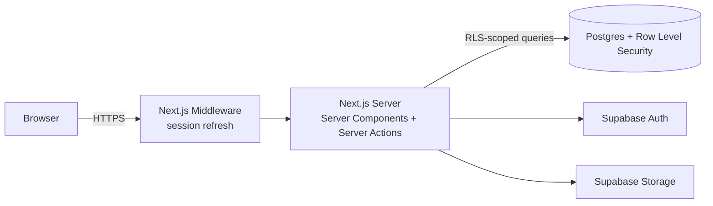

# Prometeia Issue Tracker

A web application for tracking defects found during System Integration Testing
(SIT) and User Acceptance Testing (UAT) on Prometeia's bank engagements — used
jointly by Prometeia, the bank's own testers, and (where applicable) a
dedicated SIT team, with a live KPI dashboard for tracking progress.

**Live demo:** https://issue-tracker-six-omega.vercel.app
**Design spec:** `docs/superpowers/specs/2026-09-05-uat-tracker-design.md`

---

## What it does

### Who uses it

Every engagement has three kinds of participants, each with different access:

| Role | Who | Can do |
|---|---|---|
| **Prometeia** | Prometeia's own team | Full control: create engagements, manage rosters, triage and update any ticket, configure settings |
| **Bank** | The client bank's UAT testers | Report issues for their own engagement, comment, attach files — cannot change status/priority/module/assignee |
| **SIT** | A dedicated system-integration test team, where one is engaged | Same reporting rights as Bank, tracked as a separate source so SIT-found vs. bank-found defects can be told apart |

Every engagement is fully isolated: a bank account can only ever see the
engagement(s) it has been explicitly added to, enforced at the database level
(see [Security model](#security-model) below) — not just hidden in the UI.

### Issue tracking

- **Report an issue** with a title, description, priority (critical / high /
  medium / low), module, an optional linked test case package/step, and file
  attachments (screenshots, logs) — attachments can only be added at creation
  time, keeping the audit trail of "what was actually reported" intact.
- **Workflow**: `Backlog → Ongoing → Ready for Test → Closed`, with `Rejected`
  as a terminal state for invalid reports. Only Prometeia can move a ticket
  through the workflow or reassign it.
- **Closing a ticket automatically hands it back to whoever reported it** —
  so it's immediately clear who needs to verify the fix — and reopening a
  closed ticket is tracked explicitly (a "Reopened from Ready for Test" count
  appears per-ticket and feeds a dashboard metric), which surfaces tickets
  that were marked fixed prematurely.
- **Three views** of the same data: a **Kanban board** (grouped by status,
  with inline status/priority/assignee editing for Prometeia), a **List**
  (sortable, filterable table with inline editing and an Excel export), and
  the **Dashboard** below.
- **Full history** on every ticket: every field change is logged with who
  changed it and when.
- **Threaded comments**, visually color-coded by whether the author is from
  Prometeia or the bank, with their own file attachments.
- **In-app notifications** when a ticket is assigned to you, someone comments
  on your ticket, or a ticket you reported changes status.

### Dashboard & KPIs

A BI-style dashboard per engagement, optionally scoped to a SIT or UAT testing
window (each engagement can define separate SIT/UAT date ranges):

- Status and priority distribution, module and reporting-org volume
- **Time-to-close vs. SLA** by priority (SLA targets are configurable per
  engagement, per priority) with breach counts
- **Aging report** for everything still open
- **Throughput** (opened vs. closed per week) and a **daily defects** trend
  scoped to the active testing window
- **Time-in-status** by priority (how long tickets actually sit in each
  column) and an overall **reopen rate**
- One-click export of the dashboard to **PDF** and the issue list to **Excel**

### Configuration

Each engagement is independently configurable by Prometeia: bank name and
logo, custom ticket key prefix, the list of modules and test case packages
issues can be filed against, per-priority SLA targets, and SIT/UAT testing
date windows. Team rosters (Prometeia assignees, bank members, SIT members)
are managed per engagement by adding a member's email.

---

## Technical overview

| Layer | Technology |
|---|---|
| Framework | [Next.js 14](https://nextjs.org) (App Router), TypeScript (strict), Server Actions as the only mutation path — no separate REST/GraphQL API |
| Styling | Tailwind CSS |
| Database | PostgreSQL, via [Supabase](https://supabase.com) |
| Auth | Supabase Auth (email + password) |
| File storage | Supabase Storage — a private bucket for issue/comment attachments (served via short-lived signed URLs), a public bucket for bank/Prometeia logos |
| Charts | Recharts |
| Exports | SheetJS (`xlsx`) for Excel, jsPDF + html2canvas for PDF — both loaded on demand, not part of the base page bundle |
| Tests | Vitest (unit tests over the KPI/export/session logic) |
| Hosting (current) | [Vercel](https://vercel.com) |

### Architecture



Server Components render every page directly from the database; every
mutation (creating a ticket, changing its status, adding a comment) is a
Server Action — there is no separate API layer to keep in sync.

### Security model

Access control is enforced by **Postgres Row Level Security (RLS)**, not
application code. Every table's policies are evaluated by the database on
every single query — a bug in the UI, or a request sent by hand bypassing the
UI entirely, still cannot cross an engagement boundary. Two policy building
blocks are reused everywhere:

- `is_prometeia_user()` — true only for Prometeia accounts; grants full
  access across every engagement.
- `is_engagement_member(engagement_id)` — true for Prometeia (always), or for
  a bank/SIT account explicitly added to that specific engagement's roster.

The Supabase key shipped to the browser (`NEXT_PUBLIC_SUPABASE_ANON_KEY`) is
not a trusted secret — it identifies the project, not the caller. Safety
comes entirely from RLS evaluating who is actually asking on every query.
`SUPABASE_SERVICE_ROLE_KEY`, which bypasses RLS, is never used anywhere in
this codebase and should never be added to any environment.

**Data sensitivity:** this system is scoped to support system testing only.
It stores defect descriptions, screenshots, and test status — it does not
hold production client data, account information, or anything regulated.

---

## One-time setup

### 1. Create a Supabase project

1. Go to https://supabase.com, create a free account, then "New project".
2. Once it's provisioned, go to **Project Settings → API**. Copy the **Project URL**
   and the **anon public** key. (You do not need the **service_role** key anywhere —
   it bypasses Row Level Security, the app's entire access-control boundary, and
   nothing in this codebase uses it.)
3. Copy `.env.local.example` to `.env.local` and fill in the two values:
   ```
   NEXT_PUBLIC_SUPABASE_URL=<your project URL>
   NEXT_PUBLIC_SUPABASE_ANON_KEY=<your anon key>
   ```

### 2. Run the database migrations

In the Supabase dashboard, go to **SQL Editor → New query**, and run every
file under `supabase/migrations/`, in filename order (paste each file's
contents, click Run).

### 3. Install dependencies and run locally

```bash
npm install
npm run dev
```

Open http://localhost:3000 — it redirects to `/login`.

### 4. Create the first Prometeia admin account

1. Go to `/signup`, create an account with your real Prometeia email.
2. By default Supabase requires email confirmation — check your inbox for the
   confirmation link (Supabase's default project sends real email, no extra setup
   needed for testing). Click it, then sign in at `/login`.
3. Every new account starts as a bank-tier user (`is_prometeia = false`) — nobody
   has admin rights yet on a fresh database. Promote yourself: in the Supabase
   dashboard, go to **SQL Editor** and run, substituting your email:
   ```sql
   update public.profiles set is_prometeia = true where email = 'you@prometeia.com';
   ```
4. Reload the app. You should land on `/new-engagement` (no engagements exist
   yet) and see the Prometeia logo and green "Create engagement" button.

### 5. Deploy to Vercel

1. Push this repository to a GitHub repo (already done —
   https://github.com/PromAMarra/IssueTracker, branch `main`).
2. Go to https://vercel.com, create a free account, "Add New Project", import the
   GitHub repo.
3. In the project's **Environment Variables** settings, add
   `NEXT_PUBLIC_SUPABASE_URL` and `NEXT_PUBLIC_SUPABASE_ANON_KEY` from
   `.env.local`. Do not add `SUPABASE_SERVICE_ROLE_KEY` here or anywhere else —
   it isn't used by the app (it bypasses Row Level Security) and should never be
   deployed.
4. Deploy. Vercel gives you a URL like `https://uat-tracker-yourname.vercel.app`.
5. Back in Supabase, go to **Authentication → URL Configuration** and set **Site
   URL** to that Vercel URL, so email confirmation links point at the deployed
   app instead of `localhost`.

## Adding a bank to an engagement

1. As a Prometeia user, create an engagement (bank name, modules, team members,
   SLA days) from the engagement picker's "+ New engagement…" option.
2. Send the bank contact the deployed URL and ask them to sign up at `/signup`
   with their own email.
3. Once they have an account, go to the engagement's **Settings** page and add
   their email under "Bank members". They now see that engagement (and only that
   one) next time they log in.

## Smoke test checklist

Run through this once, end to end, after deploying:

- [ ] Sign up as a Prometeia user, promote via SQL, confirm you land on
      `/new-engagement`.
- [ ] Create an engagement with 2-3 modules, 2 team members, and default SLA
      days.
- [ ] Sign up a second account (a different email/browser profile) — confirm it
      has no engagements ("No engagement yet" screen).
- [ ] As the Prometeia user, add the second account's email as a bank member in
      Settings. Confirm the second account now sees the engagement.
- [ ] As the bank account, report 2-3 issues with different priorities and
      modules. Confirm the bank account cannot see any status/priority/assignee
      edit controls on the board or in the issue detail modal.
- [ ] As the Prometeia user, move one issue through Backlog → Ongoing → Ready for
      Test → Closed, assigning it to a team member along the way. Confirm each
      change appears in the issue's History log.
- [ ] Reopen the closed issue (set its status back to Ongoing). Confirm the
      History log shows a "reopened" entry and the Dashboard's reopen rate
      updates.
- [ ] Attach a real file to an issue as the bank account; confirm the Prometeia
      account can open it from the issue detail modal.
- [ ] Add a comment as each account; confirm both appear in the thread with the
      right author name.
- [ ] Open the Dashboard: confirm stat tiles, status/priority charts,
      time-to-close vs. SLA, throughput, module/org volume, and the aging report
      all reflect the seeded issues correctly.
- [ ] Create a second engagement for a different bank, add a third account as
      that bank's member, and confirm the third account cannot see the first
      bank's engagement in its picker or by guessing the URL.
