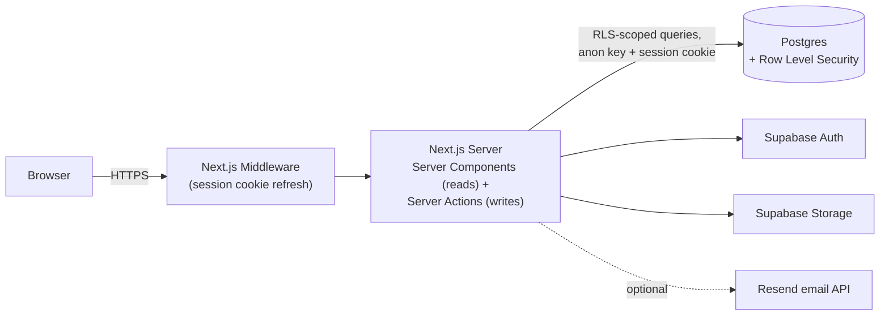

# Prometeia Issue Tracker — Technical Handover Document

**Audience:** the IT team taking over deployment, operation, and ongoing maintenance of this application.
**Purpose:** a single, code-grounded reference — architecture, data model, security model, business rules, and a file-by-file map of the codebase — so an engineer who has never seen this project can safely run, deploy, and extend it.
**Scope:** the entire repository on the `main` branch.

This document complements, rather than replaces, two other documents already in the repo:

- **[`README.md`](../README.md)** — the fastest path to "clone it, run it, deploy it." Read that first for setup/deploy steps; this document goes much deeper on *why* the code is shaped the way it is.
- **[`docs/superpowers/`](../docs/superpowers/)** — the historical design specs, implementation plans, and review reports written while each feature was built (see [Appendix A](#appendix-a-other-documentation-in-this-repository)). Useful for the *reasoning* behind a specific feature; this document is the up-to-date, consolidated picture of what actually shipped.

---

## Table of contents

1. [Executive summary](#1-executive-summary)
2. [System architecture](#2-system-architecture)
3. [Data model](#3-data-model)
4. [Security model (Row Level Security)](#4-security-model-row-level-security)
5. [Business rules & domain workflows](#5-business-rules--domain-workflows)
6. [Codebase reference (module-by-module)](#6-codebase-reference-module-by-module)
7. [Environment variables & configuration](#7-environment-variables--configuration)
8. [Local development setup](#8-local-development-setup)
9. [Deployment](#9-deployment)
10. [Database migration reference](#10-database-migration-reference)
11. [Testing](#11-testing)
12. [Known limitations, caveats & recommendations for IT](#12-known-limitations-caveats--recommendations-for-it)
13. [Glossary](#13-glossary)
14. [Appendix A: other documentation in this repository](#appendix-a-other-documentation-in-this-repository)

---

## 1. Executive summary

The **Prometeia Issue Tracker** is a defect-tracking and test-execution web application used during System Integration Testing (SIT) and User Acceptance Testing (UAT) on Prometeia's bank engagements. Three kinds of users share it per engagement — **Prometeia** (Prometeia's own consultants, full control), the **Bank**'s own UAT testers, and (optionally, per engagement) a dedicated **SIT** team — to report defects, track them through a fixed workflow, execute structured test scripts ("test packages"), and monitor progress on a live KPI dashboard.

It is a **Next.js 14 App Router** application with **no separate backend service**: every page is server-rendered directly from a **Supabase Postgres** database, and every write goes through a **Next.js Server Action**. There is no REST or GraphQL API to keep in sync, and no ORM — all queries are the Supabase JS client, and all access control is enforced by **Postgres Row Level Security (RLS)**, not by application code. This is the single most important architectural fact for whoever maintains this system: *the database, not the UI, is the security boundary.*

The codebase is ~8,800 lines of TypeScript/TSX and ~1,000 lines of SQL across roughly 90 source files, built up over 22 sequential, hand-written SQL migrations. It has a Vitest unit-test suite covering the pure business-logic functions (KPI math, export formatting, access-control tables, workload calculations), but no automated integration/e2e tests against a live database — RLS policies are verified by manual testing.

---

## 2. System architecture

### 2.1 Technology stack

| Layer | Technology | Notes |
|---|---|---|
| Framework | [Next.js](https://nextjs.org) 14.2.x, App Router | TypeScript in `strict` mode throughout. Server Actions are the *only* mutation path — there is no `app/api/` REST layer. |
| UI | React 18, Tailwind CSS, [Tabler Icons](https://tabler.io/icons) (`@tabler/icons-react`) | All icons use `stroke={1.5}` by convention. |
| Charts | [Recharts](https://recharts.org) | Every chart on the Dashboard. |
| Database | PostgreSQL, via [Supabase](https://supabase.com) | Schema is entirely hand-written SQL migrations under `supabase/migrations/` — there is no Prisma/Drizzle/other ORM and no `supabase db diff`-generated migrations. |
| Auth | Supabase Auth | Email + password. Session cookies refreshed by `middleware.ts` on every request. |
| File storage | Supabase Storage | A private `issue-attachments` bucket (signed URLs only) and a public `bank-logos` bucket (also reused for the platform-wide Prometeia logo). |
| Email | [Resend](https://resend.com) (optional) | If `RESEND_API_KEY` is unset, the app runs identically minus outbound email — see [§7](#7-environment-variables--configuration). |
| Exports | [SheetJS (`xlsx`)](https://www.npmjs.com/package/xlsx) for Excel; [jsPDF](https://github.com/parallax/jsPDF) + [html2canvas](https://github.com/niklasvh/html2canvas) for PDF | Both loaded on demand (dynamic import), not in the base page bundle. |
| Tests | [Vitest](https://vitest.dev) | Unit tests only, co-located as `*.test.ts` next to the module they cover. |
| Current hosting | [Vercel](https://vercel.com) | Auto-deploys `main` on push. No other CI/CD is configured — see [§12](#12-known-limitations-caveats--recommendations-for-it). |

Exact dependency versions are pinned in [`package.json`](../package.json); do not upgrade Next.js/React/Supabase major versions without re-testing the auth/session-refresh flow in `middleware.ts` and `lib/supabase/*`, which are sensitive to breaking changes in `@supabase/ssr`.

### 2.2 High-level architecture



There is exactly one runtime process type (the Next.js server, e.g. Vercel's serverless functions) and one external system (the Supabase project, which bundles Postgres + Auth + Storage). Nothing else needs to be provisioned or kept running.

### 2.3 Request & mutation flow

- **Reads** happen in **Server Components** (`page.tsx` files): they call a data-access function in `lib/data/*.ts`, which queries Supabase directly and returns typed data to render. There is no client-side data-fetching library (no SWR/React Query) — pages re-fetch on navigation/`revalidatePath`.
- **Writes** happen exclusively through **Server Actions** (`'use server'` functions in `app/actions/*.ts`), called directly from client components (e.g. a button's `onClick` calling an imported action). Every Server Action:
  1. Creates a Supabase client via `createServerClient()` (`lib/supabase/server.ts`) using the **anon key** plus the caller's session cookies — it never uses a service-role key.
  2. Performs the mutation.
  3. Calls `revalidatePath(...)` so the next render picks up the change (there is no client-side cache to invalidate separately).
- Because the Server Action's Supabase client is authenticated as *the calling user* (not as an admin), **every single query — read or write, from a Server Component or a Server Action — is subject to Postgres RLS**. A Server Action's own `if` checks (e.g. "only Prometeia can do X") are a UX nicety (fail fast, show a friendly error) — they are *not* the security boundary. See [§4](#4-security-model-row-level-security).

### 2.4 Repository layout

```
app/
  (app)/[engagementId]/    Every authenticated, engagement-scoped page (board, list,
                           dashboard, testing-lab, settings) shares this route group
                           and its layout.tsx (sidebar + header chrome).
  (app)/new-engagement/    Shown to a Prometeia user with zero engagements.
  actions/                 Every Server Action (the app's entire write surface).
  login/, signup/          Unauthenticated auth pages.
components/
  dashboard/               Chart/table components used only on the Dashboard.
  issues/                  Board, issue table, issue detail modal, badges, new-issue form.
  testinglab/              Testing Lab's package/step view.
  settings/                Settings page's forms (engagement config, rosters, test packages).
  notifications/, auth/    Notification bell, sign-out button.
  *.tsx (top level)        Shared app chrome: Sidebar, Header, Breadcrumbs, EngagementPicker.
lib/
  data/                    Read-side data-access functions, one file per aggregate
                           (engagements, issues, settings) — called from Server Components.
  auth/                    Session/role lookup helpers.
  email/                   Resend wiring and the three notification email templates.
  supabase/                Supabase client factories (browser/server) + fetch-retry wrappers.
  *.ts (top level)         Pure business logic — KPI math, access-control tables, Excel
                           import/export, workload calculations — deliberately kept free of
                           any Supabase/Next.js import so it is trivially unit-testable.
supabase/
  migrations/              Every schema/RLS/trigger change, in strict numeric order —
                           the database's entire change history, hand-written (no ORM).
  README.md                Short pointer to how migrations are run.
docs/superpowers/          Historical design specs, plans, and review reports (see Appendix A).
middleware.ts              Refreshes the Supabase session cookie on every request.
```

---

## 3. Data model

> **Inserted from the automated documentation pass over `supabase/migrations/`.** See [§10](#10-database-migration-reference) for the one-line history of every migration file, and [§4](#4-security-model-row-level-security) for how each table's RLS policies work.

This section documents `supabase/migrations/0001_schema.sql` through `0022_phase_scoped_results_and_owners.sql` — the entire SQL migration history of the Prometeia Issue Tracker's Postgres database. These files are applied in strict numeric order (Supabase CLI convention) and together define every table, Row-Level Security (RLS) policy, trigger, function, index, and Storage bucket the application depends on.

**Why this layer matters more than usual in this codebase:** every data mutation in the app goes through a Next.js Server Action (`app/actions/*.ts`) using the Supabase client configured with the **anon key plus the caller's own session cookies** — never a service-role key. That means a Server Action's own `if (!isPrometeia) throw ...`-style checks are a UX nicety only (fail fast, show a friendly error). The **actual** authorization boundary is whatever RLS policy Postgres evaluates when that anon-key request reaches the database. A bug or gap in a policy here is a real, exploitable authorization bug, reachable by any client that skips the Next.js app and calls PostgREST/Supabase directly with a valid session token.

**The recurring "RLS gates rows, not columns" pattern:** RLS `USING`/`WITH CHECK` clauses can only decide *which rows* a role may see or write — they cannot restrict *which columns* of an allowed row get changed. Whenever this project grants a narrow UPDATE to a restricted role (bank/SIT members), it pairs the policy with a `BEFORE UPDATE` trigger that copies `OLD.<column>` back onto `NEW.<column>` for every column that role must not be able to touch, leaving only the one or two intended fields free to change. This pattern appears three times, each iteration copied from the last: `prevent_self_promote()` (0002, protects `profiles.is_prometeia`), `test_step_result_only()` (0018, later rewritten in 0022), and `issue_bank_sit_transition_only()` (0021, superseding an earlier version in 0019). Recognize this shape immediately when reading any migration below — the policy alone never tells the whole story.

**A second recurring pattern:** every `SECURITY DEFINER` PL/pgSQL function in this schema pins `set search_path = public, pg_temp`. This is a deliberate defense against search-path hijacking (a well-known class of Postgres privilege-escalation bug against `SECURITY DEFINER` functions) and must be preserved in any new or copied function of this kind.

---

#### `supabase/migrations/0001_schema.sql`

**Purpose:** Creates the foundational schema with **no RLS yet** — `profiles`, `engagements`, `engagement_members`, `issues`, `issue_comments`, `issue_history`, `issue_attachments`. RLS is enabled immediately afterward in 0002; the two files must always be deployed together.

**Key objects:**
- `public.profiles` — mirrors `auth.users` 1:1 (same `id`). Holds `email`, `full_name`, `is_prometeia` (the master role flag).
- `public.handle_new_user() returns trigger` (`SECURITY DEFINER`) — fired by `on_auth_user_created after insert on auth.users`. Auto-creates the matching `profiles` row on signup. Must be `SECURITY DEFINER` because it runs before the new user has a session, so it needs elevated privilege to write past `profiles`' RLS (added in 0002).
- `public.engagements` — one row per bank/client engagement; carries `key_prefix`/`next_issue_seq` (ticket key generation), `sla_days` (jsonb), `modules`, and (as of later migrations) testing-period dates and flags.
- `public.engagement_members` — composite-PK roster (`engagement_id`, `user_id`); gains a `phase` column later (0012).
- `public.issues` — the core ticket table. `status` is constrained to `backlog | ongoing | ready_for_test | closed | rejected` (values only — allowed *transitions* live in RLS/triggers, not this constraint). `org` starts as `prometeia | bank`, widened to include `sit` in 0012.
- `public.issue_comments`, `public.issue_history` (append-only audit trail, Prometeia-only writes per 0002), `public.issue_attachments`.
- `public.next_issue_key(p_engagement_id uuid) returns text` (`SECURITY DEFINER`) — atomically increments `engagements.next_issue_seq` via a single `UPDATE ... RETURNING` and returns `"<prefix>-<n>"`. The single-statement update is what prevents two concurrent ticket creations from colliding on the same sequence number.

**Design decisions / caveats:** `profiles.id` deliberately equals `auth.users.id` so every other table can FK to `profiles` (queryable from the app) instead of the `auth` schema (not queryable via the Supabase client). The status/org check constraints only validate allowed *values*; the state machine itself is enforced elsewhere (0002, 0021, and `lib/issueAccess.ts`).

---

#### `supabase/migrations/0002_rls.sql`

**Purpose:** Enables RLS on every table from 0001 and defines the two foundational helper functions plus the baseline policy set. **This file is the real authorization boundary of the application** — see the domain introduction above.

**Key objects:**
- `public.is_prometeia_user() returns boolean` (`SECURITY DEFINER`, `STABLE`) — the base privilege check, used throughout nearly every later policy in this project. Reads `profiles.is_prometeia` for `auth.uid()`.
- `public.is_engagement_member(p_engagement_id uuid) returns boolean` (`SECURITY DEFINER`, `STABLE`) — true if the caller is Prometeia (implicit member of everything) **or** has an `engagement_members` row for that engagement. This is the gate behind almost every `select` policy in the schema.
- `public.prevent_self_promote() returns trigger` (`SECURITY DEFINER`), trigger `profiles_prevent_self_promote before update on public.profiles` — silently reverts `is_prometeia` to its old value on any update that wasn't performed via a definer/admin path, closing the gap that `profiles_update_self`'s row-ownership-only check would otherwise leave (a user could otherwise PATCH their own `is_prometeia` to `true`).
- Baseline policies for `profiles`, `engagements`, `engagement_members`, `issues` (select for members, insert for the reporting user with `status='backlog'` and `assignee is null`, update Prometeia-only), `issue_comments`, `issue_history` (select for members, insert Prometeia-only), `issue_attachments`.

**Design decisions / caveats:** `issues_insert`'s `with check` here is superseded twice more (0006 relaxes the `assignee is null` requirement; 0020 excludes Prometeia reporters entirely) — always check for the latest version of a policy by name across later files rather than trusting the version in the migration where it was first defined.

---

#### `supabase/migrations/0003_storage.sql`

**Purpose:** Creates the two Supabase Storage buckets (`bank-logos` public, `issue-attachments` private) and their `storage.objects` RLS policies.

**Key objects:** Public-read/Prometeia-write policies on `bank-logos`; member-read/member-write policies on `issue-attachments` gated by `public.is_engagement_member((storage.foldername(name))[1]::uuid)`.

**Design decisions / caveats:** `storage.objects` has no `engagement_id` column of its own — engagement scoping is derived purely from the **object path convention**: the first path segment of every uploaded object must be the engagement's UUID. `storage.foldername(name)` splits the path into an array and `[1]` (1-indexed) is that first segment. If app upload code ever writes to a path not prefixed by the engagement id, RLS will simply and silently deny read/write — there is no separate validation surfacing that mistake more clearly.

---

#### `supabase/migrations/0004_platform_settings.sql`

**Purpose:** Adds `public.platform_settings`, a singleton table for platform-wide (not per-engagement) configuration — currently just the Prometeia logo shown in the shared app header.

**Key objects:** `platform_settings(id boolean primary key default true, prometeia_logo_url text, constraint platform_settings_singleton check (id))`. Select policy open to all authenticated users; update policy Prometeia-only.

**Design decisions / caveats:** The boolean-primary-key-pinned-to-`true` trick prevents a **second** row from ever being inserted, but nothing stops the single row from being **deleted** by a privileged (service-role) connection — there is no delete policy either permitting or explicitly blocking it for normal roles, since normal roles simply have no delete policy at all (default-deny).

---

#### `supabase/migrations/0005_test_case_fields.sql`

**Purpose:** Adds `engagements.test_case_packages` (a configurable, Settings-editable free-text tag list) and two per-issue fields, `issues.test_case_package` / `issues.test_case_step`, letting a reported issue reference which test script/step surfaced it.

**Design decisions / caveats:** This is a lightweight, unstructured tagging mechanism, **not** related to (and not foreign-keyed to) the structured `test_packages`/`test_package_steps` tables introduced later in 0018. Nothing in the database enforces that `issues.test_case_package` actually matches an entry in `engagements.test_case_packages` — that validation, if it exists, is app-layer only.

---

#### `supabase/migrations/0006_issue_insert_assignee.sql`

**Purpose:** Drops and recreates `issues_insert` (from 0002) to drop the `assignee is null` requirement, letting a reporter suggest an assignee at ticket-creation time.

**Design decisions / caveats:** This is **not the final shape** of `issues_insert` — 0020 replaces it again to additionally forbid Prometeia users from inserting issues at all. Drop-and-recreate is the standard pattern this project uses whenever a policy's `with check` expression needs to change (Postgres has no `ALTER POLICY ... WITH CHECK`).

---

#### `supabase/migrations/0007_comment_attachments.sql`

**Purpose:** Adds a nullable `comment_id` FK to `issue_attachments`, letting an attachment belong to a specific comment instead of only the issue as a whole.

**Design decisions / caveats:** `on delete cascade` on `comment_id` deletes the attachment **row** when its parent comment is deleted, but does **not** delete the underlying Storage object (governed separately by 0003's bucket policies) — orphaned Storage objects are a possible byproduct unless app code cleans them up explicitly.

---

#### `supabase/migrations/0008_notifications.sql`

**Purpose:** (1) Converts `issues.assignee` from free text to a real `profiles` FK, `assignee_id` and drops `engagements.team_members`; (2) adds `public.notifications` and its two producing trigger functions.

**Key objects:**
- `public.notifications(id, user_id, issue_id, actor_id, type, message, created_at, read_at)` — `type` constrained (widened again in 0009) to `issue_assigned | comment_added`. Select/update-own policies for `user_id = auth.uid()`. **No insert policy for regular users at all** — every row is written exclusively by the `SECURITY DEFINER` trigger functions below, which bypass that gap by design.
- `public.notify_issue_assigned() returns trigger` (`SECURITY DEFINER`), trigger `issues_notify_assigned after insert or update of assignee_id on public.issues` — inserts a notification for the newly-assigned user, suppressing self-assignment notifications (`<> auth.uid()`) and no-op updates (`is distinct from old.assignee_id`).
- `public.notify_comment_added() returns trigger` (`SECURITY DEFINER`), trigger `comments_notify_participants after insert on public.issue_comments` — notifies the issue's reporter and (if different) its assignee about a new comment, suppressing the comment author from being notified about their own comment and de-duplicating reporter==assignee.

**Design decisions / caveats:** ⚠️ **Possible live bug, flagged for verification, not fixed by this pass:** `notify_issue_assigned()`'s trigger fires on **both** `insert` and `update of assignee_id`, but the function body unconditionally references `old.assignee_id` inside the same `if` condition as `new.assignee_id is not null`. In PL/pgSQL, `OLD` is documented as *unassigned* (not merely null) during row-level `INSERT` triggers, and dereferencing a field of an unassigned record raises a runtime error (`record "old" is not assigned yet`). Because `new.assignee_id is not null` can be `true` on `INSERT` (issues have been insertable with a non-null assignee since 0006), and Postgres's boolean `AND` still has to evaluate the second operand whenever the first is `true`, **creating an issue with an initial assignee selected may raise a Postgres error and abort the insert.** This was not run against a live database to confirm. **IT should test "create a new issue with an assignee pre-selected" end-to-end before go-live**, and if it reproduces, add a `TG_OP = 'INSERT'` branch (or otherwise guard the `OLD` reference) to `notify_issue_assigned()`.

---

#### `supabase/migrations/0009_status_notifications.sql`

**Purpose:** Adds a third notification type, `status_changed`, plus `public.notify_status_changed()` / trigger `issues_notify_status_changed after update of status`, additive alongside (not replacing) the two functions from 0008.

**Design decisions / caveats:** The `'reopened'` label computed here (`when old.status = 'closed' and new.status in (...) then 'reopened'`) is a **cosmetic-only** synthesized string for the notification message — it is never an actual value of `issues.status`, whose check constraint (0001) only allows the five real statuses. Do not confuse this with a genuine status value anywhere else in the codebase.

---

#### `supabase/migrations/0010_perf_indexes.sql`

**Purpose:** Adds indexes on FK columns Postgres does not auto-index (only the referenced PK side is auto-indexed), covering the query patterns used by board/list/dashboard/detail views: `issues(engagement_id, created_at desc)`, `issue_comments(issue_id, created_at)`, `issue_history(issue_id, changed_at desc)`, `issue_attachments(issue_id, uploaded_at)`, `issue_attachments(comment_id)`, `issues(reporter_id)`, `issues(assignee_id)`.

**Design decisions / caveats:** Pure performance change — no schema shape, RLS, or behavior impact. Must run after 0001 (tables must exist) and after 0008 (`assignee_id` didn't exist before that).

---

#### `supabase/migrations/0011_testing_periods.sql`

**Purpose:** Adds `engagements.sit_start_date` / `sit_end_date` / `uat_start_date` / `uat_end_date`, read by the dashboard to scope daily-defect / tests-per-day charts to the relevant testing window.

**Design decisions / caveats:** All four columns are nullable with no check constraint enforcing `start <= end` or preventing SIT/UAT range overlap — any such validation is app-layer only.

---

#### `supabase/migrations/0012_sit_members.sql`

**Purpose:** Introduces the SIT-vs-UAT distinction for non-Prometeia members via `engagement_members.phase text check (phase in ('sit','uat'))`, backfills every pre-existing non-Prometeia member as `'uat'`, and widens `issues.org`'s check constraint to allow `'sit'`.

**Design decisions / caveats:** `phase` is nullable and expected to stay `null` for Prometeia members (they are neither SIT nor UAT testers) — this is the **source of truth** for which phase a bank/SIT user belongs to, consumed by dashboards and by the execution-owner/result-scoping logic added later in 0022. Any code reading `engagement_members.phase` must handle `null` explicitly rather than assuming every member row has a phase.

---

#### `supabase/migrations/0013_updated_at.sql`

**Purpose:** Adds `issues.updated_at` and `public.set_issues_updated_at() returns trigger` / trigger `issues_set_updated_at before update`, stamping `now()` on every update, surfaced as "Last updated" in the List view.

**Design decisions / caveats:** Postgres fires multiple `BEFORE UPDATE` triggers on the same table in **alphabetical order of trigger name**. Later migrations add more `BEFORE UPDATE` triggers on `public.issues` (`issues_bank_sit_transition_only` from 0021; `issues_dispute_rejection_only` from 0019, later dropped) that rewrite several `NEW.*` columns. `issues_set_updated_at` only ever touches `NEW.updated_at`, so there's no conflict today — but this ordering rule matters before adding another trigger that touches a column one of these already claims.

---

#### `supabase/migrations/0014_notify_self_actions.sql`

**Purpose:** Rewrites (via `create or replace`) all three notification trigger functions from 0008/0009 to remove "don't notify me about my own action" suppression, so e.g. a user who assigns a ticket to themselves now gets the "assigned to you" notification.

**Design decisions / caveats:** Carefully distinguishes suppression logic that *was* removed (`<> auth.uid()`, `<> new.author_id`) from dedupe/real-change guards that were *kept* (`assignee_id is distinct from reporter_id` — prevents double-notifying someone who is both; `is distinct from old.*` — "did anything actually change" guards). The file's own extensive inline commentary documents exactly which condition changed in which function; read it before touching these functions again.

---

#### `supabase/migrations/0015_notifications_delete_policy.sql`

**Purpose:** Adds the missing `notifications_delete_own` policy (`delete using (user_id = auth.uid())`).

**Design decisions / caveats:** Closes a real functional gap — the "clear all notifications" UI action was a silent RLS-blocked no-op for every user until this migration, since 0008 added select/update-own policies but never a delete-own policy.

---

#### `supabase/migrations/0016_sit_expected.sql`

**Purpose:** Adds `engagements.sit_expected boolean not null default true`, flagging whether an engagement is expected to have a SIT phase at all (some engagements go straight to UAT).

**Design decisions / caveats:** Defaults to `true`, so every pre-existing engagement is treated as SIT-expected unless a Prometeia admin explicitly changes it afterward.

---

#### `supabase/migrations/0017_notification_message_format.sql`

**Purpose:** Rewrites all three notification trigger functions again (now the **currently active** versions, unchanged by any later migration) to store a short, self-contained action phrase (e.g. `"Assigned to Jane Doe"`, `"Status changed to Closed"`) instead of one repeating the issue key/title, since the client (`NotificationBell.tsx`) now renders the issue key/actor separately from `issue_id`/`actor_id`.

**Design decisions / caveats:** The status-label mapping (`v_status_label` case expression) duplicates display strings that also live client-side in `Board.tsx` / `IssueTable.tsx` / `IssueDetailModal.tsx` and in a `statusEmailLabel()` helper. There is **no single source of truth** for these labels — changing one status's display text requires updating every copy by hand, including this SQL file.

---

#### `supabase/migrations/0018_test_case_tracking.sql`

**Purpose:** Introduces the structured test-execution model: `public.test_packages` (an uploaded UAT/SIT script) and `public.test_package_steps` (its individual steps, each with a `result`), plus the first-ever RLS UPDATE grant to a non-Prometeia role in this schema.

**Key objects:**
- `test_packages(id, engagement_id, name, uploaded_by, created_at)` — select for members, insert/delete Prometeia-only.
- `test_package_steps(id, test_package_id, step_number, step_name, step_description, expected_outcome, result, result_updated_by, result_updated_at)` — `result` constrained to `passed | passed_with_minor | failed | na` (`'na'` = not applicable to this run, distinct from `null` = not yet tested).
- Policy `test_package_steps_update_bank_sit` — **inverse of every other write policy in the app**: grants UPDATE to any non-Prometeia engagement member (Prometeia explicitly excluded), because testers, not Prometeia, record results.
- `public.test_step_result_only() returns trigger` (`SECURITY DEFINER`), trigger `test_package_steps_result_only before update` — the column-pinning trigger that makes the broad-looking policy above safe: it rewrites every column except the result fields back to `OLD`, and forces `result_updated_by := auth.uid()` so that audit column can't be spoofed.

**Design decisions / caveats:** This table is superseded in part by 0022, which splits the single `result`/`result_updated_by`/`result_updated_at` columns into independent `sit_result`/`uat_result` pairs — this file's `result` column no longer exists after 0022 runs. The "RLS gates rows, not columns" pattern (see domain intro) is fully in play here: removing or weakening `test_step_result_only()` would let a bank/SIT member rewrite step content directly, even though the policy itself would look unchanged.

---

#### `supabase/migrations/0019_dispute_rejection.sql`

**Purpose:** Grants bank/SIT users their first narrow UPDATE permission on `issues` — moving a `'rejected'` issue back to `'ongoing'` ("disputing" it) — via `issues_update_dispute_rejection` plus `issue_dispute_rejection_only()` trigger, which pins every column except `status` and forces `status := 'ongoing'` regardless of what was submitted.

**Design decisions / caveats:** **This migration is fully superseded.** 0021_bank_sit_transitions.sql drops this policy/trigger/function outright and replaces them with one supporting three transitions instead of one. This file should be read only as history — it does **not** reflect current behavior in isolation.

---

#### `supabase/migrations/0020_issues_insert_bank_sit_only.sql`

**Purpose:** Drops and recreates `issues_insert` (from 0006) to add `and not is_prometeia_user()`, so only bank/SIT members can open new tickets — Prometeia's role is to work tickets, not report them.

**Design decisions / caveats:** This is the **current, final** shape of `issues_insert`; no later migration in this set (through 0022) touches it again.

---

#### `supabase/migrations/0021_bank_sit_transitions.sql`

**Purpose:** The current, authoritative implementation of every status transition a bank/SIT user may make directly on `public.issues`. Supersedes 0019's single-transition version with three: `rejected → ongoing` (dispute), `ready_for_test → closed` (verify fix), `ready_for_test → rejected` (reject fix).

**Key objects:**
- Policy `issues_update_bank_sit_transition` — `USING (status in ('rejected','ready_for_test') and is_engagement_member(...) and not is_prometeia_user())`, `WITH CHECK (is_engagement_member(...) and not is_prometeia_user())`. Note `WITH CHECK` deliberately does **not** constrain `new.status` — validating the exact `(old, new)` pair is left to the trigger, since a `WITH CHECK` clause only ever sees `NEW`, not `OLD`.
- `public.issue_bank_sit_transition_only() returns trigger` (`SECURITY DEFINER`) — raises an exception unless the attempted transition is exactly one of the three allowed pairs (`if not (...) then raise exception`), pins every other column to `OLD`, and computes `closed_at` itself (`now()` if transitioning to `closed`, else `null`) rather than trusting any client-submitted value.

**Design decisions / caveats:** This is the database-level twin of `BANK_SIT_ALLOWED_TRANSITIONS` in `lib/issueAccess.ts`. The TS constant drives UI/Server-Action-level checks (offering the right buttons, fast/friendly rejection); this SQL is what makes an illegal transition **actually impossible**, since Server Actions run with the caller's own anon-key session. **If `BANK_SIT_ALLOWED_TRANSITIONS` is ever changed, the `if not (...)` allow-list in `issue_bank_sit_transition_only()` must be updated to match by hand**, or the app and the database will silently disagree about what is permitted.

---

#### `supabase/migrations/0022_phase_scoped_results_and_owners.sql`

**Purpose:** Splits `test_package_steps`' single `result`/`result_updated_by`/`result_updated_at` (from 0018) into independent `sit_result`/`uat_result` column pairs (SIT and UAT testers can genuinely disagree on the same step), backfills existing data by phase, and adds `test_packages.sit_execution_owner_id` / `uat_execution_owner_id`.

**Key objects:**
- New nullable columns (all added `if not exists` for safe re-run): `sit_result`, `sit_result_updated_by`, `sit_result_updated_at`, `uat_result`, `uat_result_updated_by`, `uat_result_updated_at` on `test_package_steps`; `sit_execution_owner_id`, `uat_execution_owner_id` on `test_packages`.
- A one-time backfill (CTE + `UPDATE ... FROM`) that routes each pre-existing `result` to whichever phase last touched it, using `engagement_members.phase` for whoever is recorded in `result_updated_by`; a result with no editor at all (pre-filled from an uploaded sheet, never edited) becomes the UAT baseline, since UAT is this app's always-present phase.
- `public.test_step_result_only()` rewritten (`create or replace`, same trigger from 0018 stays attached) — now looks up the **actor's own** `engagement_members.phase` for the relevant engagement and only allows the matching `sit_result*` or `uat_result*` fields through, pinning the other phase's fields to `OLD`; anyone whose phase can't be resolved as `'sit'` (including a UAT/bank member or a Prometeia member with no phase row) falls through to the UAT branch.
- Policy `test_packages_update_prometeia` (new — 0018 never added an UPDATE policy for `test_packages`) — Prometeia-only, no `WITH CHECK`/pinning trigger needed since this grant never reaches an untrusted role.

**Design decisions / caveats:** Written defensively throughout (`IF NOT EXISTS` / `IF EXISTS`) so the file is safe to re-run from scratch if an earlier attempt failed partway through. The phase lookup in the rewritten trigger is scoped **per actor, per engagement** — not per step or per package, since a single step legitimately carries both a SIT and a UAT result simultaneously; this is easy to misread on a first pass. Downstream app code (dashboards, Server Actions) must treat `sit_result`/`uat_result` as fully independent fields and must not assume a single unified `result` column exists any more.

**Additional handover notes surfaced while documenting the migrations** (informational, not fixed):
- `engagements.sla_days`, `modules`, `test_case_packages` and `issues.test_case_package`/`test_case_step` have no DB-level constraint tying their values together — validation is app-layer only.
- The status-label strings used for notification messages (0017) are duplicated by hand in several TSX components and a `statusEmailLabel()` helper — there is no single source of truth.
- `platform_settings`' singleton row has no delete policy for normal roles (default-deny), but nothing at the schema level would stop a privileged connection from deleting it, which would need re-inserting.

---

## 4. Security model (Row Level Security)

Access control in this application is enforced **entirely at the database layer**. There is no middleware-based authorization, no role-check decorator, no "admin API" — every table has Postgres RLS policies that are evaluated by the database on *every single query*, regardless of whether it came from the app's UI, a Server Action, or someone hand-crafting a request against the Supabase REST endpoint with a stolen anon key. This is deliberate: **the anon key shipped to the browser (`NEXT_PUBLIC_SUPABASE_ANON_KEY`) is not a secret** — it identifies the Supabase *project*, not the caller. Safety comes entirely from RLS evaluating who `auth.uid()` actually is on every query.

Two helper SQL functions, defined once and reused across nearly every policy in the codebase:

- **`is_prometeia_user()`** — true only for accounts with `profiles.is_prometeia = true`. Grants full access across every engagement.
- **`is_engagement_member(engagement_id)`** — true for any Prometeia account (always), or for a Bank/SIT account explicitly listed in that engagement's `engagement_members` roster. This is the function that makes engagement isolation a *database* guarantee rather than a UI one: a Bank user simply cannot construct a query that returns another bank's rows, no matter what the UI does or doesn't show them.

**The "column-pinning trigger" pattern.** Several features need to grant a restricted role (Bank/SIT) permission to `UPDATE` a row it doesn't fully own — e.g. a Bank/SIT tester recording their own test result, or disputing a rejected ticket. Postgres RLS's `USING`/`WITH CHECK` clauses can gate *which rows* a role may touch, but **cannot restrict which columns** it changes within an allowed row. To close that gap, every such policy is paired with a `BEFORE UPDATE` trigger that re-copies `OLD.<column>` onto `NEW.<column>` for every column the role must not be able to change, so the UPDATE silently no-ops on anything except the one or two fields it's meant to touch — no matter what payload is actually sent. You will see this pattern (and a comment calling it out) in:

- `test_step_result_only()` (migration `0018_test_case_tracking.sql`) — a Bank/SIT tester can only ever change their own phase's result columns on a test step.
- `issue_dispute_only()` / its successor `issue_bank_sit_transition_only()` (migrations `0019_dispute_rejection.sql`, superseded by `0021_bank_sit_transitions.sql`) — a Bank/SIT user can only ever flip an issue's `status` between the three specific values they're allowed to reach, nothing else on the row.

**Never use the service-role key.** `SUPABASE_SERVICE_ROLE_KEY` — which bypasses RLS entirely — is not used anywhere in this codebase and must never be added to any environment (local or deployed). If a future feature seems to need it, that is a strong signal the RLS policy design needs to change instead, not that the service-role key should be introduced.

The full table/policy/trigger inventory — every RLS policy and every column-pinning trigger, migration by migration — is documented alongside the data model in [§3](#3-data-model) rather than repeated here, since each policy is inseparable from the table and migration it belongs to. Read §3 top-to-bottom for the complete picture; the summary above is what to keep in mind while doing so.

---

## 5. Business rules & domain workflows

### 5.1 Roles, accounts, and phases

There is exactly **one account-level role flag**: `profiles.is_prometeia`. There is no separate "Bank account" or "SIT account" type at the account level — a person is either a Prometeia consultant or they aren't. Whether a non-Prometeia account acts as "Bank" or "SIT" is decided **per engagement**, by which roster they were added to and, since migration `0012_sit_members.sql`, by an explicit `engagement_members.phase` column (`'sit' | 'uat'`). This `phase` column is the single source of truth used throughout the phase-scoped testing features (§5.5); it is *not* derivable from `issues.org` or any other column.

Promoting an account to Prometeia is deliberately impossible from within the app — it requires a Prometeia team member to run a one-line `update public.profiles set is_prometeia = true where email = '...'` directly in the Supabase SQL editor. See [`README.md`](../README.md#4-create-the-first-prometeia-admin-account).

### 5.2 Engagements & isolation

An **engagement** is one bank client's testing project — the container for its issues, test packages, rosters, and settings. A user only ever sees engagements they've been explicitly added to (`engagement_members`), enforced by RLS (§4), not hidden UI. Each engagement independently configures: bank name/logo, ticket key prefix, the list of modules and test-case packages issues can reference, per-priority SLA targets, SIT/UAT testing date windows, and whether it has a SIT phase at all (`sit_expected` — a display/availability toggle only; see the caveat in `docs/superpowers/reports/2026-09-19-functional-features.md §13`).

### 5.3 Issue status workflow

Every issue has a `status` of **Backlog → Ongoing → Ready for Test → Closed**, with **Rejected** as an additional state. Two very different sets of rules govern who can change status, depending on the current value:

- **Prometeia** can move an issue to *any* of the five statuses at any time (there is no rigid pipeline enforcement on the Prometeia side) — this is the normal triage/fix/verify flow.
- **Bank/SIT**, who normally cannot update an issue at all, get three narrow, explicit exceptions (enforced by the trigger/policy pair described in §4, and mirrored in `lib/issueAccess.ts`'s `BANK_SIT_ALLOWED_TRANSITIONS`):
  - `rejected → ongoing` — disputing a rejection, sending it back to Prometeia.
  - `ready_for_test → closed` — confirming the fix actually works.
  - `ready_for_test → rejected` — confirming the fix does *not* work, sending it back to Prometeia (this is *not* the "success path," and is counted as a bounce by `lib/kpi.ts`'s `reopenFromReadyForTestCount` — see §6.2).

  Both of these ready-for-test outcomes, and the dispute, **require the user to post a comment first** — the UI (`components/issues/IssueDetailModal.tsx`) makes the existing Comments section do double duty as the mandatory "why" note, rather than adding a separate field, and only calls the status-changing Server Action after the comment has been successfully posted.

Moving an issue to **Ready for Test, Closed, or Rejected** automatically reassigns it back to whoever originally reported it, so it's always obvious who needs to act next. Moving an issue *out of* `ready_for_test` (to ongoing/backlog/rejected) rather than to `closed` is tracked as a "reopen" and feeds the dashboard's reopen-rate metric.

### 5.4 Turn-based comments & attachments

Independent of the status-change rules above, a separate rule governs *who may currently post* a comment or attachment on a given issue:

- **Backlog / Ongoing** → "Prometeia's turn": Prometeia can comment/attach; Bank/SIT can only read.
- **Ready for Test / Closed / Rejected** → "Bank/SIT's turn": Bank/SIT can comment/attach; Prometeia can only read.

Both sides can always *read* the full thread regardless of whose turn it is — this only ever gates *posting*. One deliberate exception: a reporter filing a brand-new issue can attach files immediately, even though a fresh issue starts in Backlog ("Prometeia's turn") — that window closes permanently the moment anyone else acts on the ticket.

### 5.5 Testing Lab: test packages, phase-scoped results, execution owners

A **test package** is an uploaded Excel test script (a list of numbered steps, each with a description and expected outcome) attached to an engagement. Since migration `0022_phase_scoped_results_and_owners.sql`, **each step carries two independent result columns** — `sit_result` and `uat_result` (each `'passed' | 'passed_with_minor' | 'failed' | 'na' | null`), with their own `_updated_by`/`_updated_at` pairs — because SIT and UAT are genuinely separate testing efforts that can reach different conclusions on the same step. There is no longer a single shared `result` column (that was the pre-0022 model).

A Bank/SIT user can only ever write to *their own phase's* result column on a step, determined by looking up their own `engagement_members.phase` — never the other phase's, regardless of what the UI sends (enforced by the `test_step_result_only()` trigger, §4). Prometeia can read but never write test results.

**Execution owners.** Each test package has an independent `sit_execution_owner_id` and `uat_execution_owner_id` (Prometeia-assigned, one per phase, drawn from that phase's own roster via `lib/data/engagements.ts`'s `listBankSitTeam`) — used purely for workload reporting (§5.6), not for access control (any member of the right phase can still record a result, whether or not they're the named "owner").

### 5.6 Dashboards & KPIs

The Dashboard (`app/(app)/[engagementId]/dashboard/page.tsx`) has two sub-views, reachable from a nested sidebar entry (mirroring the Testing Lab's package sub-nav pattern):

- **Issue Insights** — defect-centric: stat tiles, status/priority distribution, time-to-close vs. SLA, time-in-status, throughput, aging report, module/org volume ("Issues raised").
- **Testing Insights** — test-execution-centric, phase-aware (All/SIT/UAT toggle, SIT hidden if the engagement doesn't have `sit_expected`): tested-vs-target-pace, results-by-package (a 100%-stacked bar that actually reflects the selected phase's results, not a single shared number), workload-by-execution-owner (assigned/tested/remaining/% tested), and a tests-per-day line chart with one series per owner and per-owner toggle pills (`components/dashboard/DailyTestsByOwnerChart.tsx`).

Both views can be scoped to the engagement's configured SIT/UAT testing date windows. The whole dashboard exports to PDF; the issue list exports to Excel.

### 5.7 Notifications

Three events generate both an **in-app notification** (bell icon, polled ~every 30s) and, if `RESEND_API_KEY` is configured, an **email**: a ticket assigned to you, a comment posted on a ticket you reported or are assigned to, and a status change on a ticket you're connected to. Notifications fire for the acting user's own actions too (migration `0014_notify_self_actions.sql`). Email is purely additive infrastructure — every code path works identically with it absent; see [§7](#7-environment-variables--configuration).

---

## 6. Codebase reference (module-by-module)

> Each subsection below was produced by an automated documentation pass that read every listed file in full. Together with the inline comments now added to each file (see the file itself for exact signatures), this is intended as a complete map of the codebase for an engineer with no prior context.

### 6.1 Server Actions — the sole mutation path

Every data mutation in the Prometeia Issue Tracker flows through one of the five files in `app/actions/`. Each file is a Next.js Server Actions module (`'use server'` at the top) and every exported async function in it is invoked directly from a Client Component — there is no separate REST/API-route layer for writes. All five files share the same request-time client, `createServerClient()` (`lib/supabase/server.ts`), which authenticates as the Supabase **ANON key** plus the caller's own session cookies. That single fact drives the whole security model of this domain: **every JS-level check in these files (`requireProm()`, `requireNonProm()`, `getSessionUser()` guards) is a UX convenience — a faster, friendlier rejection — and never the actual authorization boundary.** The real boundary is Postgres Row-Level Security (RLS), defined in `supabase/migrations/*.sql` and evaluated independently by the database for the exact same request. A recurring, deliberate pattern in this schema is that RLS policies can only gate *which rows* a role may touch, not *which columns* within an allowed row — so wherever a narrow write is granted to a restricted role (Bank/SIT), a matching Postgres trigger "pins" every column that role must not be able to change back to its `OLD` value, re-deriving the allowed change independently of whatever the client actually sent. New engineers should internalize this before changing anything here: **a JS check being removed or buggy must never be a real vulnerability, because the database re-checks everything that matters.** Two known exceptions to that invariant are called out below where they occur.

All five files also share smaller conventions worth knowing up front: every mutation that returns updated data uses an **optimistic-concurrency (compare-and-swap) pattern** — read the current row, then `.update(...).eq(<column>, <value just read>)`, and treat zero rows affected (`.maybeSingle()` returning `null`) as a conflict rather than a silent no-op; and outbound notification emails are always **fire-and-forget**, dispatched only after the underlying mutation has already committed, so a flaky email provider can never turn a successful click into an error screen.

#### `app/actions/engagements.ts`

Administers `engagements` (one row per bank/client workspace, e.g. "ADCB — UAT - ADCB") and their `engagement_members` roster. This is the only mutation path used by the engagement-creation wizard and the per-engagement Settings page.

- **`requireProm()`** *(internal)* — `async () => SessionUser` — throws `Not authorized` unless the caller is signed in and `profile.is_prometeia` is true. JS-level gate only; the real gate is the `engagements_insert_prometeia` / `engagements_update_prometeia` / `members_insert_prometeia` RLS policies (`0002_rls.sql`).
- **`validatePeriods(input: EngagementInput): void`** *(internal)* — Throws if `sitStartDate > sitEndDate` or `uatStartDate > uatEndDate`. Pure UI sanity check; there is no matching DB constraint, so a malformed range is only ever caught here, before the insert/update.
- **`createEngagement(input: EngagementInput): Promise<string>`** — Inserts a new `engagements` row and returns its id. `keyPrefix` is either the admin's custom value (sanitized via `sanitizeKeyPrefix`) or, if left blank, auto-derived from `bankName` via `keyPrefixFromBankName` (`lib/keys.ts`) — either way it ends up an uppercase, alphanumeric string safe for `next_issue_key()` (`0001_schema.sql`) to concatenate with a running sequence number when minting ticket keys like `ESUP-13`. Revalidates `/` on success.
- **`updateEngagementSettings(engagementId: string, input: EngagementInput): Promise<void>`** — Same field set as `createEngagement`, applied as an update to an existing engagement. Revalidates that engagement's `/settings` and `/dashboard` routes.
- **`uploadBankLogo(engagementId: string, formData: FormData): Promise<void>`** — Uploads the submitted `file` field to the `bank-logos` Storage bucket at `${engagementId}/logo-<timestamp>.<ext>` (upsert), then stores the resulting public URL on `engagements.bank_logo_url`. Scoped to one engagement — contrast with `settings.ts`'s `uploadPrometeiaLogo`, which is platform-wide.
- **`roleToPhase(role: MemberRole): 'sit' | 'uat' | null`** *(internal)* — **Critical mapping to know before touching membership code**: the database only knows `engagement_members.phase ∈ {'sit', 'uat'}` (`0012_sit_members.sql`) — there is no `'bank'` phase value at the DB level. The UI-facing "Bank" role is stored as `phase = 'uat'`. `'prometeia'` role members have `phase = null`.
- **`addMemberByEmail(engagementId: string, email: string, role: MemberRole): Promise<AddMemberResult>`** — Looks up an existing `profiles` row by (case-insensitive) email and inserts an `engagement_members` row for it. Business rules enforced here: (1) the target account's actual `is_prometeia` flag must match the role being granted — you cannot seat a real Prometeia account into a bank/SIT slot or vice versa; (2) a `'sit'` member can only be added if the engagement's `sit_expected` flag is on (`0016_sit_expected.sql`); (3) a Postgres unique-constraint violation (`error.code === '23505'`, meaning the person is already a member) is translated into a friendly `{ ok: false }` result instead of throwing. Revalidates `/settings` and `/board` for the engagement.
- **`listMembers(engagementId: string, role: MemberRole): Promise<Member[]>`** — Returns `{ userId, email, fullName }` for every member with the given role. Prometeia members are filtered purely by `profiles.is_prometeia`; bank/SIT members are additionally filtered by `phase` via `roleToPhase`.

**Exported types:** `EngagementInput` (the full engagement form shape — name, bank name, key prefix, modules, test-case packages, SLA days, SIT/UAT date windows, `sitExpected`, `testCasesEnabled`), `MemberRole = 'bank' | 'sit' | 'prometeia'`, `AddMemberResult = { ok: boolean; message: string }`, `Member = { userId: string; email: string; fullName: string | null }`.

#### `app/actions/issues.ts`

The largest and most security-sensitive file in this domain: the full issue/ticket lifecycle — creation, every status transition, reassignment, reprioritization, comments, attachments, and the aggregated detail view used by the ticket modal.

**Status machine** (`lib/types.ts`'s `Status`, gate logic in `lib/issueAccess.ts`): `backlog → ongoing → ready_for_test → closed`, with a `rejected` branch off `ready_for_test`. Prometeia drives the forward path; Bank/SIT members get exactly one narrow, DB-mirrored escape hatch (see `confirmBankSitStatusChange` below).

- **`createIssue(input: CreateIssueInput): Promise<string>`** — Only a non-Prometeia (Bank/SIT) caller may file a ticket (`is_prometeia` throws `Not authorized`); this is also enforced by the `issues_insert` policy (`0020_issues_insert_bank_sit_only.sql`). Validates title (1–200 chars), description (1–5000), and test-case step text (≤2000). Resolves `module` against the engagement's configured `modules` list (silently dropping an invalid value rather than erroring). Resolves `testCasePackage` against either real `test_package_steps` rows (if `test_cases_enabled`) or the legacy `test_case_packages` string list — two different sources of truth depending on how the engagement tracks test cases. Derives `org` (`'prometeia' | 'bank' | 'sit'`) from the reporter's own `engagement_members.phase`. Restricts `assigneeId` to a Prometeia member of the same engagement (silently nulled otherwise). Obtains the ticket's human-readable key via the `next_issue_key` RPC (atomic, race-safe sequence increment in `0001_schema.sql`). Fires an "assigned to you" email (fire-and-forget) if a real assignee was set. Revalidates `/board`, `/list`, and `/dashboard`. ⚠️ *See §3's note on `0008_notifications.sql` — creating an issue with an assignee pre-selected may hit a possible live bug in the assignment-notification trigger; recommended as a pre-handover smoke test.*
- **`updateIssueStatus(issueId: string, newStatus: Status): Promise<MutationResult>`** — Prometeia-only (`requireProm()`; real boundary: `issues_update_prometeia`, `0002_rls.sql`). Computes `isReopen` (closed → any open status), `isClosing`, and `isHandBack` (closed/ready_for_test/rejected — any transition that hands the ticket back to Bank/SIT), and on hand-back automatically reassigns to the reporter. Uses the optimistic-concurrency pattern conditioned on both `status` and (on hand-back) `assignee_id`. Writes an `issue_history` row for the status change, and a second one for the automatic reassignment if the assignee actually changed. **Deliberately calls no `revalidatePath` at all** — see the in-file comment for why (Next 14.2's single, route-wide `pathWasRevalidated` flag would force a full re-fetch of whichever route called it, defeating the caller's own optimistic UI patch; every route here already renders dynamically via `cookies()`, so there is no server cache to protect). Sends a status-change email (fire-and-forget) to the reporter and, on a non-hand-back change, the assignee, but only when the status genuinely changed.
- **`confirmBankSitStatusChange(issueId: string, newStatus: Status): Promise<MutationResult>`** — The *only* status mutation a Bank/SIT (non-Prometeia) member may perform: disputing a `rejected` ticket back to `ongoing`, or resolving a `ready_for_test` ticket to `closed`/`rejected`. Validates the requested transition against `BANK_SIT_ALLOWED_TRANSITIONS` (`lib/issueAccess.ts`) — this is the app-layer mirror of the `issues_update_bank_sit_transition` policy + `issue_bank_sit_transition_only` trigger (`0021_bank_sit_transitions.sql`), which independently re-validates the same allow-list and pins every other column back to `OLD`. **Keep both in sync if this transition set ever changes.** Same optimistic-concurrency and fire-and-forget email pattern as `updateIssueStatus`.
- **`updateIssuePriority(issueId: string, newPriority: Priority): Promise<MutationResult>`** — Prometeia-only. Same compare-and-swap pattern, writes one `issue_history` row, no `revalidatePath`.
- **`updateIssueAssignee(issueId: string, newAssigneeId: string | null): Promise<MutationResult>`** — Prometeia-only. Compare-and-swap on `assignee_id`, which also closes the "close vs. reassign" race (a concurrent status hand-back that already changed `assignee_id` will cause this to see a conflict instead of overwriting it). Writes one history row (resolving both the old and new assignee's display name via `profileName`). Sends an "assigned to you" email only when the assignee genuinely changed to a non-null value.
- **`updateIssueModule(issueId: string, newModule: string | null): Promise<MutationResult>`** — Prometeia-only. Same compare-and-swap/history pattern.
- **`addComment(issueId: string, body: string): Promise<string>`** — Any authenticated engagement member. Body must be 1–4000 chars. Enforces the **turn lock**: `canPostOnIssue(status, isProm)` (`lib/issueAccess.ts`) only allows posting while the ticket is "with" your side. **Important gap for IT/security to know**: unlike every other rule in this file, this turn lock has **no matching RLS enforcement** — `comments_insert` (`0002_rls.sql`) only checks engagement membership and `author_id = auth.uid()`. A request using the same anon key + a valid session cookie could post a comment out of turn by skipping the Next.js app entirely. Sends a comment-added email (fire-and-forget) to the reporter and assignee, the comment's own author included (per product decision, not excluded).
- **`listComments(issueId: string): Promise<CommentRow[]>`**, **`listHistory(issueId: string): Promise<HistoryRow[]>`**, **`listAttachments(issueId: string): Promise<AttachmentRow[]>`** — Read-only projections used by `getIssueDetail` (and independently by the UI). `listAttachments` additionally mints 1-hour signed Storage URLs for each attachment via `createSignedUrls`.
- **`uploadAttachment(issueId, engagementId, formData, commentId?): Promise<void>`** — Same turn-lock check as `addComment` (same RLS gap noted above), with one narrow exception: the ticket's original reporter may still attach a file while the ticket is technically "Prometeia's turn" (`status = 'backlog'`) as long as *nothing else has happened yet* (zero comments and zero history rows) — this lets a reporter attach screenshots immediately after filing. Uploads to the `issue-attachments` bucket at `${engagementId}/${issueId}/<timestamp>-<uuid>.<ext>`.
- **`getIssueDetail(issueId: string): Promise<IssueDetail>`** — Aggregates the full issue row plus reporter/assignee names, comments, history, and attachments (attachments partitioned into per-comment vs. top-level) into one payload for the ticket detail modal.

**Internal helpers:** `requireProm()` (Prometeia-only JS gate), `toIssueFieldsPatch()` (normalizes a raw Supabase row — including its always-singular `assignee` embed, mistyped as an array by the query builder — into `IssueFieldsPatch`), `recordHistory()` (inserts one `issue_history` row), `profileName()` (resolves a user id to a display name, `'Unassigned'` if null), `notifyByEmail()` (the fire-and-forget wrapper every email send in this file goes through — see its own extensive doc comment for why it must never be awaited and why no platform-specific `waitUntil`/`after()` is used), `recipientEmails()`, `emailIssueAssigned()`.

**Exported types:** `CreateIssueInput`, `IssueFieldsPatch`, `HistoryPatchEntry`, `MutationResult = { patch, newHistory }`, `CommentRow`, `HistoryRow`, `AttachmentRow`, `IssueDetail`.

> ⚠️ **Minor dead-code note** (informational, not fixed): in `createIssue()`, `let org: Org = session.profile.is_prometeia ? 'prometeia' : 'bank';` — the `is_prometeia` branch can never execute, since the function already throws `Not authorized` for any Prometeia caller a few lines earlier. Harmless (`org` is always correctly re-derived below), but reads as if a Prometeia-authored ticket were possible here — worth a small cleanup.

#### `app/actions/notifications.ts`

Backs the in-app notification bell. This file is **read/update/delete only** — every notification row is written exclusively by a Postgres trigger (`notify_issue_assigned` / `notify_comment_added` / `notify_status_changed`, `0008`/`0009`, redefined in `0014` and `0017`), never by application code.

- **`listNotifications(limit = 30): Promise<NotificationRow[]>`** — The caller's own notifications (`user_id = session.id`), newest first, joined to the related issue's `engagement_id`/`key` and the actor's display name (falling back to `'someone'` for the theoretically-nullable `actor_id`).
- **`getUnreadNotificationCount(): Promise<number>`** — Count of unread rows for the badge. Returns `0` (not an error) for a signed-out caller.
- **`markNotificationRead(id: string): Promise<void>`** — Sets `read_at` on one of the caller's own notifications.
- **`markAllNotificationsRead(): Promise<void>`** — Sets `read_at` on every unread row for the caller.
- **`deleteNotifications(ids: string[]): Promise<void>`** — Bulk-deletes the given ids, scoped to the caller's own rows. Short-circuits before touching the session/DB at all when `ids` is empty (the "delete all" toolbar action when there's nothing to delete).

All five functions scope to `user_id = session.id`, independently re-enforced by the `notifications_select_own` / `_update_own` / `_delete_own` RLS policies (`0008_notifications.sql`, `0015_notifications_delete_policy.sql`).

**Exported types:** `NotificationType = 'issue_assigned' | 'comment_added' | 'status_changed'`, `NotificationRow`.

#### `app/actions/settings.ts`

The smallest file in this domain: one Server Action for a platform-wide (not per-engagement) setting.

- **`uploadPrometeiaLogo(formData: FormData): Promise<void>`** — Prometeia-only (`requireProm()`). Uploads the submitted file into the shared `bank-logos` Storage bucket under a `_platform/` prefix (reused rather than a dedicated bucket, since this is the only platform-wide image), then writes the resulting public URL onto the singleton `platform_settings` row (`id` is a boolean pinned to `true` by a check constraint — `0004_platform_settings.sql`, so there is always exactly one row). Calls `revalidatePath('/', 'layout')` — the root layout segment, not just the settings page, because the Prometeia logo renders in the layout every route shares.

#### `app/actions/testPackages.ts`

Manages UAT/SIT **test packages**: Prometeia-uploaded Excel test scripts, parsed into `test_package_steps`, executed independently by SIT and UAT testers. Since migration `0022`, each step carries **two fully independent result columns** (`sit_result`/`uat_result`, each with its own `_updated_by`/`_updated_at`) rather than one shared `result` — SIT and UAT can genuinely disagree about the same step, and both opinions are preserved. This file is also home to the app's **only** Bank/SIT-exclusive write path (`updateTestStepResult`) — every other mutation in the app flows the opposite direction (Prometeia writes, Bank/SIT reads or narrowly disputes).

- **`uploadTestPackage(engagementId: string, name: string, formData: FormData): Promise<{ packageId: string; stepCount: number }>`** — Prometeia-only. Requires the engagement's `test_cases_enabled` flag (Settings toggle) to be on. Parses the uploaded `.xlsx` (dynamically imported `xlsx` library, kept out of the main server bundle) via `parseTestCaseSheet` (`lib/testCaseImport.ts`), inserts a `test_packages` row, then inserts all parsed steps with their sheet-provided result seeded into `uat_result` (UAT is the app's always-present phase; a pre-filled result is treated as a UAT baseline, never a SIT one). On a steps-insert failure, best-effort deletes the just-created package (not a real transaction — the Supabase JS client has no multi-statement transaction primitive). Revalidates `/settings` and `/testing-lab`.
- **`deleteTestPackage(engagementId: string, packageId: string): Promise<void>`** — Prometeia-only. Deletes a package (cascades to its steps via FK), scoped to both `id` and `engagement_id`; throws a friendly error if nothing matched (already deleted).
- **`listTestPackageNames(engagementId: string): Promise<TestPackageName[]>`** — `React.cache()`-wrapped read of `{ id, name }` for every package in the engagement, for any authenticated user.
- **`listTestPackages(engagementId: string): Promise<TestPackageSummary[]>`** — Package list with step counts and both phases' execution owner ids, for the Testing Lab list view.
- **`setTestPackageExecutionOwner(packageId: string, phase: 'sit' | 'uat', ownerId: string | null): Promise<void>`** — Prometeia-only. Sets `sit_execution_owner_id` or `uat_execution_owner_id` independently — a package can have a different owner per phase (or none), drawn from that phase's own roster.
- **`getTestPackageDetail(engagementId: string, packageId: string): Promise<TestPackageDetail>`** — Full package detail (both execution owners, all steps with both phases' results) for the package detail screen, sorted by `step_number`.
- **`updateTestStepResult(stepId: string, result: TestResult | null, previousResult: TestResult | null): Promise<void>`** — The Bank/SIT-exclusive write path (`requireNonProm()`). Looks up the caller's own `engagement_members.phase` for this step's engagement to decide **which** pair of columns (`sit_result*` or `uat_result*`) to write — this mirrors, but does not replace, the `test_step_result_only` trigger (`0022`), which independently re-derives the actor's phase server-side from `auth.uid()` and pins every other column (including the *other* phase's result) back to `OLD`, regardless of what this action's payload contains. Uses the optimistic-concurrency pattern conditioned on `previousResult`, throwing a "changed since you loaded it" error on conflict.
- **`listTestCaseStepOptions(engagementId: string): Promise<TestCaseStepOption[]>`** — Flattened `{ packageName, stepName }` list across all packages, used to populate the "link to test case step" picker on the new-issue form.
- **`listTestPackagesWithResults(engagementId: string): Promise<TestPackageWithResults[]>`** — Returns **both** phases' results for every step, unfiltered; callers (the dashboard) pick whichever phase they're currently viewing (via `lib/testPackageKpi.ts` / `lib/testPackageDashboard.ts`) and the raw per-owner data also feeds the workload view.

**Internal helpers:** `requireProm()` (Prometeia-only gate), `requireNonProm()` (the inverse — this app's only Bank/SIT-exclusive gate).

**Exported types:** `TestPackageSummary`, `TestPackageName`, `TestPackageStepDetail`, `TestPackageDetail`, `TestCaseStepOption`, `TestPackageResultStep`, `TestPackageWithResults`.

### 6.2 Core business logic (`lib/*.ts`)

This section documents the pure, dependency-light modules under `lib/` that encode the application's domain rules and analytics — as opposed to the Server Actions (`app/actions/*.ts`) that perform I/O, or the React components that render UI. Every function documented here is a plain TypeScript function: no Supabase client, no React, and (with the exception of the two `export*` helpers, which touch the DOM/`document` and dynamically import a rendering library) no side effects. They take already-fetched data as arguments and return plain data or strings, which makes them cheap to unit test (each has a matching `*.test.ts` file) and safe to call from both server and client code.

Two architectural facts to internalize before touching any file below:

1. **RLS is the real authorization boundary, not this code.** Every Server Action uses the Supabase *anon* key plus the caller's session cookies — Postgres Row-Level Security policies (and, for narrow per-column carve-outs, triggers that "pin" columns a role shouldn't touch) are what actually stop an unauthorized write from reaching the database. `lib/issueAccess.ts` in particular is a JS-level mirror of a DB-level rule (`supabase/migrations/0021_bank_sit_transitions.sql`) and must be kept in sync with it by hand.
2. **Phase-scoped test results have no single source of truth.** Since migration `0022_phase_scoped_results_and_owners.sql`, a test step has independent `sit_result`/`uat_result` columns (SIT and UAT testers can disagree). None of `lib/testPackageDashboard.ts`, `lib/testPackageKpi.ts`, or `lib/testWorkload.ts` know about "SIT" or "UAT" internally for result values — the caller (the dashboard page) is responsible for picking one phase's result per step before calling in.

#### `lib/issueAccess.ts`

**Purpose:** Authorization *helpers* (not the authorization boundary itself) for the issue lifecycle. Answers "whose turn is it to post?" and "what status changes can a Bank/SIT user make directly?".

**Key exports:**
- `issueTurnIsProm(status: Status): boolean` — returns `true` if the ticket is currently "with" Prometeia (`backlog` or `ongoing`), `false` if it's with Bank/SIT (`ready_for_test`, `closed`, `rejected`). This is the single predicate the other two functions build on.
- `canPostOnIssue(status: Status, isProm: boolean): boolean` — `true` only when the actor's side matches whoever currently "owns" the ticket per `issueTurnIsProm`. Used by `app/actions/issues.ts` to gate comment/attachment writes server-side, mirroring a UI-level disable.
- `turnLockedMessage(status: Status): string` — the user-facing copy explaining why posting is currently blocked, so the UI and the server-side rejection show consistent wording.
- `BANK_SIT_ALLOWED_TRANSITIONS: Partial<Record<Status, Status[]>>` — the *only* two status transitions a Bank/SIT member may perform directly: `rejected -> ongoing` (disputing a rejection) and `ready_for_test -> closed | rejected` (verifying or rejecting Prometeia's fix). Consumed by `app/actions/issues.ts`'s `confirmBankSitStatusChange` for server-side validation, and by any UI building the set of status options to offer.

**Design decisions / caveats:** This file is deliberately a thin, framework-free mirror of a database rule. The *real* enforcement is the RLS policy + trigger in `supabase/migrations/0021_bank_sit_transitions.sql`; this map exists so the client can build correct dropdown options and the server can reject bad requests early with a friendly error, without a round trip to Postgres. **If `BANK_SIT_ALLOWED_TRANSITIONS` is ever changed, the migration's trigger must be updated in lockstep**, or the UI and the database will silently disagree about what a Bank/SIT user can do. A comment is required (by UI convention, not enforced in this file) before either transition is submitted — see `IssueDetailModal`'s comment flow and `confirmBankSitStatusChange` in `app/actions/issues.ts`.

#### `lib/kpi.ts`

**Purpose:** The full analytics layer behind the dashboard's "Issue Insights" view — distributions, SLA time-to-close, aging, throughput, a daily open/closed/live-defects trend, time-in-status breakdowns, and reopen rate.

**Key exports:**
- `statusDistribution(issues: Issue[]): Record<Status, number>` / `priorityDistribution(issues: Issue[]): Record<Priority, number>` — simple counts per bucket, pre-seeded with zero for every possible value so charts never have to handle a missing key.
- `moduleVolume(issues: Issue[]): { module; count }[]` — issue counts grouped by `module` (defaulting to `'Unassigned'`), sorted descending by count.
- `orgVolume(issues: Issue[]): { org; count }[]` — counts per `Issue['org']`, returned in a **fixed** `bank, sit, prometeia` order (not sorted by count) so the chart's legend/series ordering never reshuffles as counts change.
- `timeToCloseByPriority(issues: Issue[], sla: SlaDays): TimeToCloseRow[]` — for each priority, average/median days-to-close among issues that are `closed` and have a `closed_at`, plus how many breached the configured SLA target for that priority.
- `agingReport(issues: Issue[], sla: SlaDays, now: Date): AgingRow[]` — every still-open issue (excludes `closed`/`rejected`) with days-open and whether it has breached its SLA target, sorted oldest-first.
- `throughputByWeek(issues: Issue[], weeks: number, now: Date): ThroughputBucket[]` — opened vs. closed counts per Monday-starting ISO week, for the last `weeks` weeks ending at `now`.
- `dailyDefects(issues: Issue[], startDate, endDate, now: Date): DailyDefectBucket[]` — one row per calendar day in `[startDate, endDate]`, capped at `now` (a configured period can extend into the future, and there's no data yet for days that haven't happened — plotting them would flatline the live-defects line). `liveDefects` is a historical snapshot: issues created on/before that day and not yet closed as of that day's end, not simply "today's open count".
- `statusDurations(issue: Issue, history: StatusHistoryEvent[], now: Date): Record<Status, number>` — total days an issue has spent in each status across its whole lifecycle, correctly handling multiple reopen cycles. Relies on reading each event's `fromValue` (the *actual* status being left) for the *next* segment, since a "reopened" event's `toValue` is a generic label rather than the real target status.
- `reopenFromReadyForTestCount(history: StatusTransitionEvent[]): number` — counts how many times a ticket left `ready_for_test` for anything other than `closed` (i.e. `ongoing`, `backlog`, or `rejected`) — the "sent back after Prometeia thought it was fixed" metric.
- `timeInStatusByPriority(issues, history, now): TimeInStatusRow[]` — average/median time-in-status broken down by priority, built on top of `statusDurations`; an issue that never passed through a given status doesn't drag that status's average toward zero (it's excluded, not counted as zero).
- `reopenRate(issues, history): ReopenRateResult` — percentage of ever-closed issues (closed now, or reopened at some point) that were reopened at least once.

**Design decisions / caveats:** Every function takes `now: Date` as an explicit argument rather than calling `new Date()` internally, making the whole module deterministic and unit-testable — callers (the dashboard page) must be careful to pass one consistent `now` across a single render, or different charts could disagree about "today". "Days" are raw `(end - start) / 86_400_000` — fractional calendar days based on wall-clock timestamps, not business days, not rounded. History-derived metrics depend entirely on `issue_history` rows being written correctly by the Server Actions in `app/actions/issues.ts`; a missing or malformed history row will silently skew these numbers rather than throwing an error.

#### `lib/keys.ts`

**Purpose:** Derives and validates the short, letters-only prefix used to build human-facing ticket keys (e.g. `ADCB-123`) for an engagement.

**Key exports:**
- `keyPrefixFromBankName(bankName: string): string` — auto-derives a prefix from a bank's display name: uppercase, strip non-letters, take the first 4 characters.
- `sanitizeKeyPrefix(input: string): string` — validates/normalizes a Prometeia admin's own custom prefix choice (uppercase, alphanumeric only, up to 10 characters).

**Design decisions / caveats:** Both functions fall back to the literal `'ENG'` when the input yields no valid characters at all (e.g. a bank name that's all numbers/symbols, or an empty custom prefix) — this is a deliberate never-empty guarantee, since an empty `key_prefix` would produce malformed ticket keys. Called exclusively from `app/actions/engagements.ts` when an engagement is created or its key prefix is edited in Settings; the result is stored on the `engagements.key_prefix` column.

#### `lib/navSections.ts`

**Purpose:** Defines the fixed set of top-level, per-engagement navigation sections and determines which one is "active" for a given URL.

**Key exports:**
- `NavSectionKey = 'board' | 'list' | 'dashboard' | 'testing-lab' | 'settings'` and `NAV_SECTIONS: { key: NavSectionKey; label: string }[]` — the ordered list of sections, each with a display label.
- `activeNavSection(pathname: string, engagementId: string): NavSectionKey | null` — given the current pathname and engagement id, returns which section (if any) is active, matching both the bare section route (`board`) and any sub-route beneath it (`board/123`), so a detail page still highlights its parent section.

**Design decisions / caveats:** `NAV_SECTIONS` is the single source of truth for valid section keys, but nothing enforces at compile time that every route actually under `app/(app)/[engagementId]/` corresponds to one of these keys — adding a new top-level route without a matching `NAV_SECTIONS` entry means it will simply render with nothing highlighted in the sidebar, not fail to build. Consumed by `components/Sidebar.tsx` and `components/Breadcrumbs.tsx`.

#### `lib/retryAsync.ts`

**Purpose:** A small, dependency-free retry-with-exponential-backoff utility for wrapping async calls that can fail outright on a dropped connection.

**Key export:**
- `retryAsync<T>(fn: () => Promise<T>, attempts = 4): Promise<T>` — calls `fn`, retrying on any thrown error up to `attempts` times total, waiting 400ms, 800ms, 1.6s between attempts before finally rethrowing the last error.

**Design decisions / caveats:** Environment-agnostic (plain `setTimeout`/`Promise`, no Node- or browser-specific APIs), unlike the server-only `fetchWithRetry(Node)` helper (§6.3) that patches `fetch` for server-side Supabase clients. **Important gotcha:** it retries on *any* thrown error unconditionally — it does not distinguish a transient network drop from a genuine application error (bad input, a 4xx, a thrown validation error). Only wrap operations that are safe to blindly re-invoke (idempotent reads, or upserts) — never a mutation that could have partially succeeded before throwing, since a retry could double-apply it.

#### `lib/testCaseImport.ts`

**Purpose:** Parses an uploaded UAT/SIT test-script spreadsheet (already converted to row objects, e.g. via `XLSX.utils.sheet_to_json`) into structured step records ready for insertion as `test_package_steps` rows.

**Key exports:**
- `ParsedTestStep` — `{ stepNumber, stepName, stepDescription, expectedOutcome, result: TestResult | null }`.
- `ParseTestCaseSheetResult = { ok: true; steps: ParsedTestStep[] } | { ok: false; error: string }` — a discriminated-union result type instead of throwing, so the caller (`app/actions/testPackages.ts`) can surface `error` directly as a user-facing message.
- `parseTestCaseSheet(rows: Record<string, unknown>[]): ParseTestCaseSheetResult` — validates that all required columns (`Step name`, `Step`, `Step description`, `Expected outcome`) are present (header matching is case/whitespace-insensitive), then maps each row to a `ParsedTestStep`. A missing/non-numeric `Step` cell falls back to the row's 1-based position rather than failing the whole import. Fully blank trailing rows (no step name) are silently dropped. An optional `Result` column, if present, is parsed via a small alias table (`passed`, `passed with minor`, `failed`, `na`/`n/a`).

**Design decisions / caveats:** This module is pure and synchronous; the caller does the actual file parsing (XLSX → rows) and the database insert. **Important:** the optional `result` field parsed here is treated by the caller as a *UAT* baseline only — since migration 0022 split results into independent `sit_result`/`uat_result` columns, `app/actions/testPackages.ts` maps this value onto `uat_result` exclusively (UAT being the always-present phase); it is never written to `sit_result`. Do not assume `result` corresponds to a shared/generic result column — there isn't one anymore.

#### `lib/testPackageDashboard.ts`

**Purpose:** Analytics for the Testing Insights dashboard's tested-vs-target trend chart and per-package result breakdown chart.

**Key exports:**
- `TestPackageStepResult = { result: TestResult | null; resultUpdatedAt: string | null }` — phase-agnostic; callers must pick one phase's result/timestamp pair per step before calling in (see the dashboard page's `toSitResult`/`toUatResult` mappers).
- `testedTrend(steps: TestPackageStepResult[], startDate: string, endDate: string, now: Date): TestedTrendPoint[]` — one row per day in `[startDate, endDate]` with `cumulativeTested` (steps tested on or before that day) and `targetCumulative` (a straight-line target based on elapsed time). `cumulativeTested` is `null` for any day after `now`, so the actual-progress line stops rather than flatlining into the future. A step with no `resultUpdatedAt` (legacy data, tested before that column existed) is conservatively counted as tested on every day. The target line is clamped to 100% once the period has ended.
- `PackageResultBreakdown = { packageName, passed, passedWithMinor, failed, na, notTested }` and `perPackageResultBreakdown(packages): PackageResultBreakdown[]` — a per-package count of each result bucket, for the stacked breakdown chart.

**Design decisions / caveats:** Entirely phase-agnostic by design — nothing in this file knows about SIT vs. UAT. This keeps it reusable for both phases but means an incorrect phase-selection upstream (in the dashboard page) would silently produce a "wrong phase" chart with no error from this module. ⚠️ *Naming holdover, flagged by the dashboard-components pass too: `result`/`resultUpdatedAt` are pre-0022 field names — they work correctly only because the dashboard page remaps `sitResult`/`uatResult` onto them before calling in. Worth a rename for clarity.*

#### `lib/testPackageKpi.ts`

**Purpose:** Computes the top-line KPI tiles (total / tested / failed / to-be-tested, each with a count and a percentage) shown for a test package or for the whole Testing Insights view.

**Key exports:**
- `TestPackageKpis = { total, testedCount, testedPercent, failedCount, failedPercent, toBeTestedCount, toBeTestedPercent }`.
- `testPackageKpis(steps: { result: TestResult | null }[]): TestPackageKpis` — `testedCount` is any step with a non-null result; `failedCount` is specifically `result === 'failed'`; percentages are rounded to one decimal place and return `0` (not `NaN`) when `total` is `0`.

**Design decisions / caveats:** Phase-agnostic, same as `testPackageDashboard.ts` — the caller must already have resolved each step to one phase's result. Used by both `app/(app)/[engagementId]/dashboard/page.tsx` and `components/testinglab/TestPackageView.tsx`.

#### `lib/testWorkload.ts`

**Purpose:** Per-execution-owner workload metrics and a per-owner, per-day tested-steps series, for the "who owns what" side of Testing Insights.

**Key exports:**
- `WorkloadStep = { sitResult, sitResultUpdatedAt?, uatResult, uatResultUpdatedAt? }`, `WorkloadPackage = { sitExecutionOwnerId, uatExecutionOwnerId, steps: WorkloadStep[] }`, `WorkloadMember = { id, name, phase: 'sit' | 'uat' }`.
- `computeWorkload(packages: WorkloadPackage[], members: WorkloadMember[]): WorkloadRow[]` — for each member, sums `steps` across every package where that member is the owner *for their phase* (`sitExecutionOwnerId`/`uatExecutionOwnerId` are independent — one package can have a different owner per phase, or none), then counts how many of those steps already have a result recorded for that phase. Members with zero assigned steps are omitted entirely rather than shown as a zero row.
- `dailyTestsByOwner(packages, members, phase: 'sit' | 'uat', startDate, endDate): DailyTestsPoint[]` — one row per day in the period, one key per owner (`DailyTestsPoint = { date: string; [ownerId: string]: string | number }`), counting how many of that owner's steps were updated (for the given phase) on that specific day. Deliberately keyed by member **id**, not name, so two owners who happen to share a display name never collide in the series data — chart components map id → name separately for the legend.

**Design decisions / caveats:** A `WorkloadMember` is scoped to exactly one phase, reflecting that a Bank/SIT user's phase is fixed for an engagement (`engagement_members.phase`); this module never needs to reconcile one member appearing as both a SIT and a UAT owner because the caller is expected to pass members already filtered/tagged by their one phase.

#### `lib/types.ts`

**Purpose:** Central, dependency-free domain type definitions shared by every pure function in `lib/`, every Server Action in `app/actions/`, and most UI components. No logic beyond two small label lookup tables.

**Key exports:**
- `Status = 'backlog' | 'ongoing' | 'ready_for_test' | 'closed' | 'rejected'` and `STATUSES: Status[]` — the issue lifecycle state machine.
- `Priority = 'critical' | 'high' | 'medium' | 'low'` and `PRIORITIES: Priority[]`.
- `Org = 'prometeia' | 'bank' | 'sit'`.
- `Issue`, `IssueHistoryEntry`, `SlaDays = Record<Priority, number>` — the core issue-tracking shapes.
- `TestResult = 'passed' | 'passed_with_minor' | 'failed' | 'na'`, `TEST_RESULTS: TestResult[]`, `TEST_RESULT_LABELS: Record<TestResult, string>` — a single `TestResult` always represents one phase's opinion (never a merged/shared value), consistent with the `sit_result`/`uat_result` split introduced in migration 0022.

**Design decisions / caveats:** **Critical, easy-to-miss invariant:** these types are kept in sync with the actual Postgres schema *by hand* — there is no generated-types pipeline (e.g. Supabase CLI codegen) wiring this file to `supabase/migrations/*.sql`. Any migration that adds, renames, or removes a column, or changes a check-constraint's allowed enum values (most importantly `issues.status` and the test-result columns), must be reflected here manually, or TypeScript will compile code against a shape the database doesn't actually have.

#### `lib/exportPdf.ts`

**Purpose:** Client-side-only helper that rasterizes a DOM element (a rendered dashboard) into a paginated PDF for download.

**Key export:**
- `exportElementToPdf(elementId: string, title: string, filename: string): Promise<void>` — looks up the element by id, dynamically imports `html2canvas` and `jspdf` (deferred so this large rendering dependency chain only loads when someone clicks "Download as PDF"), screenshots the element to a canvas, then slices that single tall image across as many A4 pages as needed using jsPDF (jsPDF has no native "continue on next page" primitive, so the same full-height image is re-added per page at an increasingly negative vertical offset so each page's fixed viewport reveals a different slice).

**Design decisions / caveats:** Must run in a browser (uses `document.getElementById`), not during SSR. This is a **visual snapshot** of whatever is currently rendered on screen, including any client-side filters/phase selection already applied — it is not a server-rendered or data-driven report, so anything not actually visible (e.g. scrolled out of a nested scroll container) will not appear in the export. Consumed by `components/dashboard/ExportDashboardButton.tsx` / `ExportPdfButton.tsx`. ⚠️ *Flagged, not fixed: the pagination loop's height bookkeeping was not independently re-derived for edge cases (e.g. content whose height is an exact multiple of the printable page height, which could add a trailing blank page) — worth a manual visual check against a few real dashboard sizes.*

#### `lib/exportXlsx.ts`

**Purpose:** Client-side helper for exporting arbitrary tabular data as a downloaded `.xlsx` workbook, with built-in defense against CSV/formula injection.

**Key exports:**
- `XlsxSheet = { name: string; rows: Record<string, unknown>[] }`.
- `sanitizeCell(value: unknown): unknown` — if a string cell's first character matches `/^[=+\-@\t\r]/`, it is prefixed with a leading apostrophe (Excel's own force-text marker) so Excel/Sheets never interprets it as a formula. This matters because sheet data comes from free-text user input (issue titles, modules, assignee names, etc.).
- `downloadWorkbook(sheets: XlsxSheet[], filename: string): Promise<void>` — dynamically imports the `xlsx` library (deferred so it only loads on actual export), builds one worksheet per `XlsxSheet` (running every row through `sanitizeCell` first), and triggers the browser download. Worksheet names longer than Excel's hard 31-character limit are silently truncated rather than erroring.

**Design decisions / caveats:** Any UI component offering an "Export to Excel" action should route through `downloadWorkbook` rather than calling the `xlsx` library directly, so the formula-injection sanitization is never accidentally bypassed. `sanitizeCell` is exported on its own, presumably for direct reuse/testing, but any new export path must remember to call it (nothing enforces this at the type level).

### 6.3 Data access, auth, email & Supabase infrastructure

#### `lib/data/engagements.ts`

Read-only data-access layer for `engagements` and `engagement_members`, called from Server Components/Actions via the per-request Supabase client (anon key + session cookies).

- `listAccessibleEngagements(): Promise<EngagementSummary[]>` — returns `{id, name, bank_name}` for engagements, ordered by creation date. **No membership filter is applied in code** — it relies entirely on Postgres RLS to scope results to the caller's engagements. Wrapped in React `cache()` since it's called once from the engagement layout and again from the page inside it.
- `getEngagement(id): Promise<Engagement | null>` — full engagement record (branding, key prefix, enabled modules/test packages, SLA days, SIT/UAT date ranges, feature flags). Also does no membership check; a non-member id returns `null` via RLS, not an app-level guard. `cache()`-wrapped for the same reason.
- `listPrometeiaTeam(engagementId): Promise<TeamMember[]>` — Prometeia-side roster for the assignee picker, joining `engagement_members` to `profiles` filtered to `is_prometeia = true`. Readable by any engagement member; only Prometeia can mutate the roster (`app/actions/engagements.ts`).
- `listBankSitTeam(engagementId): Promise<PhaseTeamMember[]>` — Bank/SIT roster with each member's `phase` (`'sit' | 'uat'`), used for the execution-owner picker (Settings) and workload view (Dashboard).
- `getOwnPhase(engagementId, userId): Promise<'sit' | 'uat' | null>` — looks up the caller's own phase, which determines which of a test-step's two result columns (`sit_result`/`uat_result`) they're allowed to edit. Returns `null` for Prometeia members or anyone with no phase recorded.

**Caveat:** the two "no filter" queries are a deliberate architectural choice (RLS as the sole authorization boundary), but it means a bug or a loosened RLS policy here has no JS-level safety net — it would leak full engagement rows cross-tenant.

#### `lib/data/issues.ts`

Read-only data-access layer for `issues` and `issue_history`. Same RLS-as-boundary pattern as `engagements.ts`.

- `listIssues(engagementId): Promise<IssueWithNames[]>` — all issues for an engagement, newest first, with `reporterName`/`assigneeName` resolved from two disambiguated embedded `profiles` joins (`profiles!reporter_id`, `profiles!assignee_id`), falling back to email when `full_name` is unset.
- `getIssue(issueId): Promise<Issue | null>` — single issue by id, **no engagement filter at all**; visibility is 100% RLS-enforced.
- `listHistoryForEngagement(engagementId): Promise<IssueHistoryEntry[]>` — history rows scoped to an engagement via an `issues!inner(engagement_id)` embed (inner join is required here — a left join would let other engagements' history rows through with a null relation instead of being filtered out).

**Caveat:** identical pattern to `engagements.ts` — no application-level tenant/membership checks; entirely dependent on `issues`/`issue_history` RLS policies being correct.

#### `lib/data/settings.ts`

Read-only access to the singleton `platform_settings` table (global, cross-engagement settings such as the Prometeia logo).

- `getPlatformSettings(): Promise<PlatformSettings>` — returns `{prometeiaLogoUrl}`. Uses `.eq('id', true)` because `platform_settings.id` is a boolean primary key that is always `true`, guaranteeing exactly one row can exist (singleton-table pattern). `cache()`-wrapped for the same double-call-per-request reason as `engagements.ts`. Mutations are Prometeia-only, in `app/actions/settings.ts`.

#### `lib/auth/session.ts`

Resolves "who is making this request" for Server Components/Actions.

- `getSessionUser(): Promise<SessionUser | null>` — calls Supabase Auth's `getUser()`, then joins to the app's `profiles` row (`full_name`, `email`, `is_prometeia`). Fails closed (returns `null`, treated as signed out) if the auth call throws after `fetchWithRetry`'s retries are exhausted, or if no user/profile is found. Prefers `user.email` over `profile.email` (Auth is the source of truth; profile email is only a fallback). `cache()`-wrapped so the ~3+ call sites per request share one Auth round trip + profile query.

**Caveat/critical invariant:** this is explicitly a UX/convenience layer, not the authorization boundary — every downstream query using this session's identity is still gated by RLS via the caller's own session cookies, not by anything computed here.

#### `lib/email/issueEmails.ts`

Pure (no I/O) content builders for notification emails plus recipient-selection logic — no network calls, all output is consumed by `sendNotificationEmail`.

- `statusEmailLabel(status, isReopen): string` — human-readable status label; a closed→open transition renders as "Reopened" rather than the raw target status.
- `issueKeyPrefix(key): string` — recovers an engagement's `key_prefix` from an issue key (e.g. `"ESUP-12"` → `"ESUP"`) via the last `-`, avoiding an extra engagements query.
- `issueUrl(ctx): string | null` — builds a deep link to the ticket; returns `null` (email omits the link) when `SITE_URL` is unset.
- `issueAssignedEmail`, `commentAddedEmail`, `statusChangedEmail` — return `{subject, body}` for each notification type. Comment emails deliberately omit the comment text itself, matching the in-app notification.
- `commentEmailRecipientIds({reporterId, assigneeId, authorId})` and `statusChangedEmailRecipientIds({reporterId, assigneeId, actorId})` — both return `[reporterId, assigneeId?]` (deduped when they're the same person), deliberately **not** excluding the actor/author — users are notified about their own actions too.

**Critical gotcha (dual-write risk):** these recipient functions are written to exactly mirror the DB triggers `notify_status_changed` and `notify_comment_added` (migration 0014), which independently create in-app notification rows. If a trigger's logic changes, this file must be updated to match or emails and in-app notifications will silently diverge — nothing enforces the two stay in sync.

#### `lib/email/resend.ts`

Sole owner of the `resend` package import and `RESEND_API_KEY`.

- `isResendConfigured(): boolean` — true iff `RESEND_API_KEY` is set.
- `getResendClient(): Resend | null` — lazily constructs and memoizes a singleton `Resend` client; returns `null` (rather than throwing) when unconfigured.

**Caveat:** Node.js-runtime only — the `resend` SDK is not Edge-safe, so this must never be imported from `middleware.ts`.

#### `lib/email/sendNotificationEmail.ts`

Single entry point Server Actions use to send a notification email.

- `sendNotificationEmail({to, subject, body}): Promise<void>` — no-ops with a log if `RESEND_API_KEY` or `NOTIFICATION_FROM_EMAIL` is unset; otherwise sends via Resend racing a 5s timeout (`withTimeout`), since the installed Resend SDK version has no `signal`/AbortSignal support. **Never throws** — any failure (config missing, timeout, Resend error, thrown exception) is caught and logged, so a triggering mutation is never rolled back by an email failure. Note the timeout race means a "failed" send may still complete server-side on Resend's end after this function has already returned.

#### `lib/supabase/client.ts`

- `createClient()` — browser-side Supabase client (`createBrowserClient`) using the public anon key. Currently used only in `app/login/page.tsx`, `app/signup/page.tsx`, and `components/auth/LogoutButton.tsx` for direct `supabase.auth.*` calls; everything else in the app talks to Supabase from the server. Anon key is safe to ship client-side; RLS still governs everything.

#### `lib/supabase/fetchWithRetry.ts`

- `fetchWithRetry(input, init?, attempts=5): Promise<Response>` — Edge-runtime-safe (plain `fetch`, no Node built-ins) retry wrapper with exponential backoff (400ms → 3.2s) for outbound-connection flakiness. Used as the `global.fetch` override for the Supabase client in `lib/supabase/middleware.ts` (Edge runtime can't load the Node-only sibling below).

#### `lib/supabase/fetchWithRetryNode.ts`

- `fetchWithRetryNode(input, init?, attempts=5): Promise<Response>` — Node-only retry wrapper (same backoff schedule) built on `undici`'s own `fetch`, with a short-lived `Agent` (`keepAliveTimeout: 200ms`) to work around a suspected dead-pooled-connection issue on this network. Used as the `global.fetch` override in `lib/supabase/server.ts`. The code casts to `any` when calling `undiciFetch` because mixing an externally-installed undici `Agent` into Node's own global fetch throws (`InvalidArgumentError`) due to divergent bundled undici versions.

#### `lib/supabase/middleware.ts`

- `updateSession(request: NextRequest): Promise<NextResponse>` — called from root `middleware.ts` on every matched request. Refreshes Supabase session cookies (via `cookies.setAll`, invoked internally when Supabase rotates tokens) and redirects unauthenticated users away from non-auth routes. If the `auth.getUser()` check fails even after `fetchWithRetry`'s retries (Edge runtime, more exposed to this network's connection drops than the Node.js side), it **lets the request through** rather than bouncing a possibly-signed-in user to `/login` — this is explicitly a UX redirect, not the real security boundary; real enforcement is Postgres RLS plus the Node.js-runtime session check in `app/(app)/layout.tsx`.

#### `lib/supabase/server.ts`

- `createServerClient()` — the Supabase client used by nearly every Server Component and every Server Action in `app/actions/*.ts`. Built with the anon key plus the current request's cookies (never a service-role key), using `fetchWithRetryNode` as its fetch implementation. This is the linchpin of the app's "RLS is the real boundary" design: every query issued through it is evaluated by Postgres as the signed-in caller. The `cookies.set` calls are wrapped in try/catch because calling `cookieStore.set` from a Server Component (rather than a Server Action/Route Handler) throws — middleware refreshes the session instead in that case.

#### `middleware.ts`

- `middleware(request): Promise<NextResponse>` — thin Edge entry point delegating to `updateSession`. `config.matcher` excludes `_next/static`, `_next/image`, and `favicon.ico` (never auth-gated) and applies to everything else, including API routes.

**Bugs/risks noticed but not fixed** (informational):
1. **No application-level tenant checks anywhere in `lib/data/*`** — `listAccessibleEngagements`, `getEngagement`, `getIssue`, `listIssues`, and `listHistoryForEngagement` all trust RLS completely with zero JS-level membership filtering. Consistent with the stated architecture, but it means these functions have no defense-in-depth: any RLS policy regression on `engagements`, `issues`, or `issue_history` immediately becomes a cross-tenant data leak with no secondary check to catch it. Worth flagging to IT as a place where RLS policy review deserves extra scrutiny.
2. **`sendNotificationEmail`'s timeout race is not a true cancellation** — if the 5s timeout fires first, the function returns as if the send failed/timed out, but the underlying Resend HTTP request may still complete afterward. Documented as intentional, but worth knowing if debugging "the email arrived, why does the log say timeout."
3. **Dual-write coupling between `lib/email/issueEmails.ts` and DB triggers `notify_status_changed`/`notify_comment_added`** (migration 0014) — recipient logic is hand-mirrored between TypeScript and PL/pgSQL with no shared source of truth or automated check that they stay identical.
4. **`lib/supabase/fetchWithRetryNode.ts`'s `undiciFetch` call uses an `any` cast**, bypassing type safety on the fetch call — a workaround for a real cross-version-undici runtime incompatibility, not a stylistic choice, but worth a TODO for whoever eventually bumps dependencies.

### 6.4 Routing & pages (App Router)

This section documents every file under `app/` that defines a route in the Next.js 14 App Router tree: the root layout, the two public auth pages, the `(app)` route group's shared layout and its top-level pages, and every page nested under the dynamic `[engagementId]` segment (board, list, dashboard, settings, testing lab). None of these files perform data mutations — all writes happen in `app/actions/*.ts` Server Actions — but nearly every one performs an **authorization-relevant read**: resolving the signed-in session, resolving the `:engagementId` route param to a real engagement row, and deciding what to redirect to versus what to render. The single most important fact for a new engineer to internalize before touching any file in this section is that **these pages' own `if (!session) redirect(...)` / `if (!engagement) redirect(...)` / `if (!session.profile.is_prometeia) redirect(...)` checks are UX conveniences, not the security boundary.** The Supabase client used everywhere here (`createServerClient()`, from `lib/supabase/server.ts`) authenticates as the caller using their session cookies and the Supabase **anon** key — every query it issues is still subject to Postgres Row-Level Security. A page-level check that was ever accidentally removed or bypassed would not, by itself, open up unauthorized data access; RLS is the actual enforcement layer. Conversely, a `getEngagement()` (or `listIssues()`, `listHistoryForEngagement()`, etc.) call that returns nothing does not necessarily mean "no such row" — for a user who is not a member of that engagement, RLS silently filters it out, which is indistinguishable at the application-code level from the row not existing. Every page that does `if (!engagement) redirect('/')` is relying on that fact.

A second theme worth understanding before working in the dashboard page specifically: since migration 0022, a test step's SIT and UAT results are two **independent** columns (`sit_result` / `uat_result`, each with its own `updated_by`/`updated_at`) rather than one shared `result` — SIT and UAT testers can genuinely disagree about the same step, and there is no single canonical verdict to fall back to. Every testing-KPI computation in the dashboard page has to explicitly pick one phase's column.

#### `app/layout.tsx`

**Purpose.** The Next.js root layout — the single `<html>`/`<body>` wrapper for the entire application, including the unauthenticated `/login` and `/signup` routes. Declares page metadata (`title`/`description`) and loads the two Google Fonts (Inter, JetBrains Mono) used across the whole design system.

**Key export.** `export default function RootLayout({ children }: { children: React.ReactNode }): JSX.Element` — synchronous, no data fetching. Renders `<html lang="en">` with font preconnect/stylesheet `<link>` tags in `<head>`, and `{children}` inside `<body className="font-sans">`.

**Design notes / caveats.** Because this layout also wraps the public auth pages, it must never be given a reason to depend on Supabase, cookies, or any authenticated context — doing so would either break the login/signup pages or introduce an unnecessary round trip on every unauthenticated page load. There is no error boundary or loading UI defined at this level; those are left to more specific segments.

#### `app/(app)/layout.tsx`

**Purpose.** The layout for the `(app)` route group, i.e. everything an authenticated user sees: the root landing page, "new engagement", and the entire `[engagementId]/*` subtree. Its sole responsibility is the coarse-grained "is anyone signed in at all" gate.

**Key export.** `export default async function AppLayout({ children }): Promise<JSX.Element>` — calls `getSessionUser()` (`lib/auth/session.ts`); if there is no session, `redirect('/login')`. Otherwise renders `children` with no additional chrome — this layout intentionally knows nothing about engagements, roles, or phases.

**Design notes / caveats.** `getSessionUser()` is wrapped in React's `cache()`, so this call and every other call to it later in the same request (in a nested layout, a page, or code they call) share a single Supabase Auth round trip plus one `profiles` lookup — cheap to call repeatedly, not a query to be hoisted or memoized manually. All finer-grained access control (per-engagement membership, per-role screens, per-phase editing rights) is layered on by files further down the tree; this file should stay minimal.

#### `app/(app)/page.tsx`

**Purpose.** The `/` landing route for a signed-in user. It is a pure router: it never renders a real "page" of its own except in the one terminal case where the user has no engagement to go to.

**Key export.** `export default async function RootPage(): Promise<JSX.Element>` — fetches the session, then `listAccessibleEngagements()` (`lib/data/engagements.ts`). If the user has at least one engagement, redirects to `/{engagements[0].id}/board`. If they have none and are Prometeia staff, redirects to `/new-engagement` (since only Prometeia can create engagements). Otherwise (a bank/SIT user with zero engagements), renders a minimal "No engagement yet — ask your Prometeia contact to add {email}" screen using `MinimalHeader` and `getPlatformSettings()` for branding.

**Business rule / caveat.** `listAccessibleEngagements()` issues an **unfiltered** `select` against the `engagements` table — there is no `WHERE user_id = ...` in application code. It relies entirely on Postgres RLS to scope the result to engagements the caller is actually a member of. The result is also ordered oldest-created-first, so "the first engagement" redirected to is simply the user's earliest engagement by creation date, not a "primary" or "most recently active" one — there is no such concept modeled anywhere in this app.

#### `app/(app)/new-engagement/page.tsx`

**Purpose.** The `/new-engagement` form Prometeia staff use to create a brand-new bank/client engagement.

**Key export.** `export default async function NewEngagementPage(): Promise<JSX.Element>` — gates on session + `is_prometeia`, then renders `MinimalHeader` (with the platform's Prometeia logo, fetched via `getPlatformSettings()`) and the `NewEngagementForm` client component, which owns the actual submission/Server Action for creating the engagement — this file does no writing itself.

**Design notes / caveats.** Access here is Prometeia-only, enforced by a page-level redirect for UX only; the real enforcement is the RLS `INSERT` policy on `engagements` that the form's underlying Server Action call is still subject to. `MinimalHeader` (not `Header`) is used deliberately — this route is reached before any engagement (and therefore any bank logo) exists, so the full engagement-aware header component would have nothing to show.

#### `app/login/page.tsx`

**Purpose.** `/login` — the public sign-in screen, one of only two unauthenticated routes in the app (the other being `/signup`). Client component (`'use client'`) that talks to Supabase Auth directly from the browser.

**Key export.** `export default function LoginPage(): JSX.Element` — local state for `email`, `password`, `error`, `loading`. `handleSubmit` calls `supabase.auth.signInWithPassword({ email, password })` (via `lib/supabase/client.ts`'s anon-key browser client), wrapped in `retryAsync` (`lib/retryAsync.ts`).

**Business rules / caveats — both load-bearing.**
1. The `signInWithPassword` call is wrapped in `retryAsync` and a `try/catch` specifically because a dropped connection throws instead of resolving with `{ error }`; without the retry+catch, the sign-in button would previously get stuck on "Signing in…" forever with no user feedback. Only once retries are exhausted does the page show "Could not reach the server."
2. On success, the page navigates with a **hard** `window.location.href = '/'` rather than `router.push()`/`router.refresh()`. This is intentional: a client-side transition can be served from Next.js's router cache, so the middleware (which reads the auth cookie via `updateSession`) would never see a fresh request carrying the just-set session cookie. A full navigation forces the server to actually re-check auth with the new cookie present. **Do not "optimize" this to a client-side route change** — doing so reintroduces an intermittent "still looks logged out right after logging in" bug.

#### `app/signup/page.tsx`

**Purpose.** `/signup` — self-service account creation via `supabase.auth.signUp`, called directly from the browser with the anon key.

**Key export.** `export default function SignupPage(): JSX.Element` — collects `fullName`, `email`, `password`; on submit calls `supabase.auth.signUp({ email, password, options: { data: { full_name: fullName } } })` (retried via `retryAsync`). On success, flips to a "check your email" confirmation screen instead of navigating away.

**Business rule / caveat.** Signing up only creates a Supabase Auth user (and, via a database trigger elsewhere in the schema, a linked `profiles` row) — it grants **no access to any engagement**. A freshly confirmed/signed-in user with no memberships lands on `app/(app)/page.tsx`'s "No engagement yet" screen and must wait for a Prometeia admin to add their email to an engagement's roster (Settings → member management). The confirmation copy on this page deliberately tells the user to make sure their Prometeia contact has their email for exactly that reason.

#### `app/(app)/[engagementId]/layout.tsx`

**Purpose.** The layout wrapping every route nested under one engagement — board, list, dashboard, settings, testing lab. Resolves the `:engagementId` route param to a real engagement, fetches the shared chrome data (accessible-engagements list for the switcher, platform settings for branding, test-package names for the sidebar), and renders `Header` + `Sidebar` + `Breadcrumbs` around `children`.

**Key export.** `export default async function EngagementLayout({ children, params }): Promise<JSX.Element>` — redirects to `/login` if unauthenticated; calls `notFound()` if `getEngagement(params.engagementId)` returns null (see the domain-level caveat above — this covers both "id doesn't exist" and "you're not a member").

**Design notes / caveats.** `listTestPackageNames(engagement.id)` is only fetched when `engagement.test_cases_enabled` is true, since the Sidebar only shows the test-package list in that case — this is a deliberate query-avoidance optimization, not an oversight. Every page nested under this layout re-fetches `getEngagement` itself rather than receiving it via props/context; this is intentional under React's request-scoped `cache()` (the second call is free) and keeps each page independently self-sufficient, but it does mean the same "not found vs. not authorized" ambiguity gets re-checked (and re-redirected slightly differently, as `notFound()` here vs. `redirect('/')` in the pages) at two levels.

#### `app/(app)/[engagementId]/board/page.tsx`

**Purpose.** `[engagementId]/board` — the Kanban board view, and the default landing page inside an engagement (per `app/(app)/page.tsx`'s redirect).

**Key export.** `export default async function BoardPage({ params, searchParams }): Promise<JSX.Element>` — fetches the engagement, all issues (`listIssues`), the Prometeia team roster (for the assignee picker), and — only for non-Prometeia users — the test-case step options used by the "new issue" modal's linkage field (`listTestCaseStepOptions`). Renders `NewIssueModal` (bank/SIT users only), the `Board` itself, and, when `?issue=<id>` is present, `IssueDetailModal` as an overlay.

**Business rules / caveats.**
- `NewIssueModal` is deliberately gated to `!session.profile.is_prometeia` — raising issues is a bank/SIT responsibility; Prometeia's role is to work the backlog (`backlog → ongoing → ready_for_test`), not to file new tickets from this screen.
- The `listTestCaseStepOptions` fetch is skipped entirely for Prometeia users specifically because `NewIssueModal` — the only consumer of that data — never renders for them; this avoids an unnecessary full test-package/step join on the board's primary (Prometeia) audience.
- `listIssues()` has no role/org filter beyond `engagement_id` — every member of the engagement gets every issue back from this call; any phase/org-based UI filtering happens client-side in consuming components, and cross-engagement isolation is RLS's job, not this query's.

#### `app/(app)/[engagementId]/list/page.tsx`

**Purpose.** `[engagementId]/list` — the flat, sortable table view of the same issue set the board shows, enriched with per-issue audit history.

**Key export.** `export default async function ListPage({ params, searchParams }): Promise<JSX.Element>` — fetches engagement, issues, Prometeia team, and `listHistoryForEngagement()` (issue_history rows) in parallel, then hands them all to `IssueTable`, plus `engagement.sit_expected` so the table knows whether to expose a SIT column/filter at all. Same `?issue=<id>` → `IssueDetailModal` overlay pattern as the board.

**Design notes / caveats.** `sitExpected` exists purely to hide SIT-related UI on engagements that don't use a SIT phase — such engagements only ever produce `bank`/`prometeia`-org issues, and showing a SIT filter/column would be actively misleading. Shares the board page's "null engagement → redirect home" ambiguity described in the domain intro.

#### `app/(app)/[engagementId]/dashboard/page.tsx`

**Purpose.** `[engagementId]/dashboard` — the KPI/reporting screen, and by far the most complex file in this domain. It renders one of two independent sub-dashboards based on `?view=`:
- **Issue Insights** (default / `view=issues`): defect KPIs computed by the pure functions in `lib/kpi.ts` (`statusDistribution`, `priorityDistribution`, `timeToCloseByPriority`, `throughputByWeek`, `moduleVolume`, `orgVolume`, `agingReport`, `timeInStatusByPriority`, `dailyDefects`, `reopenRate`) from raw `issues` + `issue_history` rows.
- **Testing Insights** (`view=testing`, only reachable when `engagement.test_cases_enabled`): test-execution KPIs from `lib/testPackageKpi.ts`, `lib/testPackageDashboard.ts` and `lib/testWorkload.ts`, computed from `listTestPackagesWithResults()`.

**Key export.** `export default async function DashboardPage({ params, searchParams }): Promise<JSX.Element>`, where `searchParams: { phase?: string; view?: string; testPackage?: string }`.

**Key module-level constant.** `const PHASE_ORG: Record<'sit' | 'uat', 'sit' | 'bank'> = { sit: 'sit', uat: 'bank' }` — maps a testing *phase* (`sit`/`uat`, the engagement-membership concept) to the corresponding issue *org* value (`sit`/`bank`, the field stored on an `issues` row) — the two enums don't share vocabulary for the "uat"/"bank" side, so this table exists to bridge them wherever the phase filter is applied to the issue list.

**Business rules / caveats (the ones that matter most for maintenance):**
1. **View fallback.** `view` resolves to `'testing'` only if `searchParams.view === 'testing'` *and* `engagement.test_cases_enabled`; otherwise it silently falls back to `'issues'`, even on an explicit `?view=testing` link. This means a bookmarked/shared testing-dashboard URL degrades gracefully instead of breaking if test-case tracking is later turned off for that engagement.
2. **Query cost is view-gated.** `allIssues`/`allHistory` are fetched only when `view === 'issues'`; `testPackages`/`bankSitTeam` only when `view === 'testing'`. A single request only ever pays for one view's data.
3. **Phase filter is a display filter, not a security boundary.** `?phase=sit|uat` (only exposed in the UI when `engagement.sit_expected`) scopes both sub-dashboards' numbers to one phase by filtering already-fetched data — issues via `PHASE_ORG`, with Prometeia-authored issues (`org === 'prometeia'`) always included regardless of phase since they belong to neither phase specifically. Any signed-in member can flip between phases freely; nothing here restricts who can see which phase's numbers.
4. **History is scoped to the same issue set.** `issueIds` is derived from the already-phase-filtered `issues` array (not a separate query), and `history` is filtered against it — this guarantees the audit-trail data lines up 1:1 with whatever set of issues the KPI tiles/charts above were computed from.
5. **A "period" needs both dates.** `sitPeriod`/`uatPeriod` are only non-null when *both* the corresponding start and end date are set in Settings; a half-configured range is treated identically to "not configured" (no open-ended fallback).
6. **Independent per-phase test results.** Since migration 0022, `sit_result`/`uat_result` are separate columns with their own tester/timestamp — there is no single "the" result. `toSitResult`/`toUatResult`/`toSelectedPhaseResult` exist specifically to let every downstream KPI function (which only understands one generic `result` field) be fed the correct phase's column; `toSelectedPhaseResult` falls back to UAT (this app's always-present phase) when no phase is selected, used for the KPI tiles and per-package breakdown chart — the two trend charts don't need this fallback since SIT and UAT already render as two separate panels side by side.
7. **Duplicated phase-toggle helpers.** `testingPhaseLink`/`testingPhaseClass` intentionally duplicate `phaseLink`/`phaseClass` rather than reusing them, because every testing-view link must additionally preserve `view=testing` in the query string — reusing the issue-view helpers as-is would silently drop the user back to Issue Insights on click.
8. **Owner filtering avoids empty series.** `sitOwners`/`uatOwners` (fed into `DailyTestsByOwnerChart`) are filtered down to roster members who actually have a `computeWorkload` row, so a phase member who hasn't been assigned ownership of anything doesn't show up as a flat, meaningless zero line.
9. **SIT's daily-tests series has a second gate.** `sitDailyTests` additionally requires `engagement.sit_expected` (not just a configured `sitPeriod`), since an engagement with SIT disabled has no SIT roster/phase to attribute tests to even if stale SIT period dates happened to still be present.

**Caveat for reviewers:** this page does a large amount of derived-data computation inline (filters, maps, small transforms) rather than delegating all of it to `lib/`. That is a design choice already in place — flagged here only so a new engineer knows to read the whole function rather than assuming all business logic lives in `lib/kpi.ts`/`lib/testWorkload.ts`.

#### `app/(app)/[engagementId]/settings/page.tsx`

**Purpose.** `[engagementId]/settings` — the Prometeia-only administration screen for one engagement: metadata/date fields, branding logos, the three membership rosters, and test-package management.

**Key export.** `export default async function SettingsPage({ params }): Promise<JSX.Element>` — gates on `is_prometeia` (redirects non-Prometeia users straight to the board). Fetches the engagement, bank members, Prometeia members, and platform settings in parallel; then conditionally fetches SIT members (`sit_expected`), test packages and the Bank/SIT team roster (`test_cases_enabled`). Composes `SettingsForm`, `BankLogoUploader`, `PrometeiaLogoUploader`, one `MemberManager` per role (`prometeia`, conditionally `sit`, `bank`), and conditionally `TestPackageManager`.

**Business rules / caveats.**
- The `is_prometeia` redirect is, again, a page-level UX guard only. Every write triggered from this page's children (adding/removing a member, uploading a test package, uploading a logo, editing engagement fields) goes through its own Server Action, which re-derives authorization independently and is further constrained by the relevant RLS `INSERT`/`UPDATE` policies — a reviewer should not treat this redirect as the actual access-control mechanism.
- The SIT member-manager section and the entire test-package section are both conditionally rendered *and* conditionally fetched based on `sit_expected` / `test_cases_enabled` — an engagement that doesn't use SIT, or doesn't track test cases, simply never issues those queries or shows those UI sections, rather than fetching and then hiding empty data.

#### `app/(app)/[engagementId]/testing-lab/page.tsx`

**Purpose.** `[engagementId]/testing-lab` — where testers step through one uploaded test package at a time and record (or, for Prometeia, just view) SIT and UAT results independently per step.

**Key export.** `export default async function TestingLabPage({ params, searchParams }): Promise<JSX.Element>`, where `searchParams: { package?: string }`. Redirects to the board if `!engagement.test_cases_enabled` (the route is meaningless without test-case tracking). Fetches package names, the Prometeia team, test-case step options, the Bank/SIT team, and — only for non-Prometeia users — `getOwnPhase(engagementId, session.id)`. Resolves the active package from `?package=<id>` (falling back to the first/newest package if the param is absent or invalid), fetches that package's full detail (`getTestPackageDetail`), resolves each execution owner id to a display name, and renders `TestPackageView`.

**Business rules / caveats.**
- **Package selection fails safe.** An invalid or missing `?package=` id silently falls back to the first package rather than erroring — this also means a forged/stale package id in the URL cannot be used to probe for the existence of other packages' ids; it just silently substitutes a valid one.
- **`userOwnPhase` drives UI only, not authorization.** It tells `TestPackageView` which of the two result columns (`sit_result` vs `uat_result`) the signed-in tester should be shown as editable; Prometeia users always get `null` since they never edit results. The actual enforcement of "you may only touch your own phase's result column" happens in `updateTestStepResult` (`app/actions/testPackages.ts`) and, beneath that, the `test_step_result_only` Postgres trigger, which independently re-derives the caller's phase from `engagement_members` and pins the other phase's columns back to their prior values regardless of what the update payload contains — this page's `userOwnPhase` value has no bearing on what the database will actually accept.
- **`key={activePackageId}` is deliberate.** Forcing a full remount of `TestPackageView` when the active package changes ensures no client-side state (e.g. in-progress edits, expanded rows) from the previously viewed package leaks into the next one.
- **Owner-name resolution is best-effort.** `ownerName(id)` looks the id up in the Bank/SIT roster and returns `null` if not found — which covers both "unassigned" and, in principle, "the assigned owner was since removed from the roster," without distinguishing the two.

**Notes surfaced while documenting this domain** (informational, not fixed): (1) every page's own "null engagement" handling relies on RLS to make "not a member" and "doesn't exist" indistinguishable, by design — see the domain intro; (2) the `[engagementId]/layout.tsx`'s `notFound()` and each nested page's own `redirect('/')` handle a null engagement differently, though the layout's check should always run first in practice.

### 6.5 Dashboard components

This module is the presentation layer for both dashboard views on `app/(app)/[engagementId]/dashboard/page.tsx` — **Issue Insights** (defect volume, SLA/aging, throughput) and **Testing Insights** (UAT/SIT test-package execution, workload, pace-vs-target). Every component here is a "dumb" renderer: all business logic, aggregation, date-bucketing and SLA/breach math lives upstream in `lib/kpi.ts`, `lib/testPackageDashboard.ts`, `lib/testWorkload.ts`, `lib/exportXlsx.ts` and `lib/exportPdf.ts`, and is computed once per request by the (server-rendered) dashboard page before being passed down as props. None of these components fetch data, call Supabase, or perform a Server Action — they are safe to reason about purely in terms of their props.

Two dashboard-wide conventions recur across this module:
- **Phase awareness without phase logic.** The dashboard page exposes an "All / SIT / UAT" toggle (`?phase=sit|uat`) that most components respect passively: they render whichever pre-filtered/pre-selected data they're given (`forcedPhase` in `DailyDefectsChart`, or simply which array the page chose to pass) rather than filtering by org/phase themselves.
- **Charts render Recharts primitives; tables render plain `<table>`s.** Both categories are purely presentational, and colors/labels for shared enums (`Status`, `Priority`, `Org`) are duplicated as local `Record<..., string>` constants in each chart file rather than centralized — a new engineer changing a status color must currently update it in each chart file that displays it.

#### `components/dashboard/StatTile.tsx`

Generic KPI tile (`{ label, value, sublabel? }`) used for every single-number metric on both dashboard views ("Total issues", "Open", "Reopen rate", "% tested", etc.). `StatTile({ label, value, sublabel? })` renders a bordered card with a small uppercase label, a large monospace value, and an optional secondary line. It does **not** format numbers itself (no rounding, no `%` suffix) — every caller must pre-format `value` into its exact display string.

#### `components/dashboard/StatusDistributionChart.tsx`

Vertical Recharts `BarChart` of issue counts by `Status`. `StatusDistributionChart({ distribution: Record<Status, number> })` reshapes `lib/kpi.ts`'s `statusDistribution()` into a Recharts-friendly array, coloring one bar per status with a value label on top. The Y-axis domain is padded 20% above the max value (`Math.ceil(dataMax * 1.2) || 1`) so the top bar's label doesn't get clipped; `|| 1` guards a zero-height axis when every count is 0.

#### `components/dashboard/PriorityDistributionChart.tsx`

Same shape and rationale as `StatusDistributionChart`, bucketed by `Priority` with a red-to-pale-orange severity gradient. `PriorityDistributionChart({ distribution: Record<Priority, number> })` reshapes `lib/kpi.ts`'s `priorityDistribution()` output using the same 20%-padded Y-axis trick.

#### `components/dashboard/TimeToCloseChart.tsx`

Grouped bar chart (actual vs. SLA target) per priority, for closed issues only. `TimeToCloseChart({ rows: TimeToCloseRow[] })` renders, per priority, a gray "SLA target" bar next to an "Actual average" bar colored red if the average breached the target or green otherwise. **Caveat:** a priority with zero closed issues (`avgDays === null`) renders as a 0-height green bar rather than being omitted — the only way to distinguish "0-day average" from "nothing closed yet" is the closed-count caption printed below the chart.

#### `components/dashboard/TimeInStatusTable.tsx`

Priority × Status matrix table of average days spent per status. `TimeInStatusTable({ rows: TimeInStatusRow[] })` indexes `lib/kpi.ts`'s `timeInStatusByPriority()` rows into a `Map` keyed by `"${priority}:${status}"` for O(1) lookup while iterating the full `PRIORITIES × STATUSES` grid. A pair with no matching row (e.g. no critical issue was ever "Rejected") renders as an em-dash rather than "0d" — there is a real distinction in the source data between "average of zero" and "never happened," and only the latter renders as a dash.

#### `components/dashboard/ThroughputChart.tsx`

Two-line trend chart (opened vs. closed) over a trailing weekly window. `ThroughputChart({ buckets: ThroughputBucket[] })` plots `lib/kpi.ts`'s `throughputByWeek()` output directly. The window length (currently 8 weeks, chosen by the dashboard page) isn't a prop of its own — the heading text derives it from `buckets.length`, so changing the window length upstream automatically updates the heading with no code change here.

#### `components/dashboard/DailyDefectsChart.tsx`

Composed bar+line chart: daily opened/closed defect counts as bars, plus a "current live defects" trend line, over a configured SIT and/or UAT testing period. `DailyDefectsChart({ issues, sitPeriod, uatPeriod, forcedPhase })` calls `lib/kpi.ts`'s `dailyDefects()` for whichever period is selected, then negates the `opened` count (`openedNeg`) purely so the "Defects new" bar visually diverges downward from "Defects closed." Period selection: an explicit `forcedPhase` (from the SIT/UAT toggle) wins; with no phase forced ("All"), it falls back to `sitPeriod ?? uatPeriod` — ⚠️ **if both periods are configured, "All" silently shows only the SIT window**, with no on-screen indication that UAT dates aren't plotted. If neither period is configured, the component renders a placeholder telling the user to configure one in Settings instead of an empty/misleading chart.

#### `components/dashboard/DailyTestsByOwnerChart.tsx`

Per-execution-owner daily test-throughput line chart, with per-owner show/hide toggle pills. `DailyTestsByOwnerChart({ label, points, owners })` renders one line per owner from `lib/testWorkload.ts`'s `dailyTestsByOwner()` output, keyed by owner id (not name, so two owners sharing a display name never collide). ⚠️ Colors are cycled from a fixed 8-color palette by the owner's *position* in the `owners` array — stable within one render, but not guaranteed stable across separate renders/reloads if ordering ever changes upstream (cosmetic only). Renders `null` when `owners` is empty, so a phase with no execution owner assigned doesn't show an empty chart shell.

#### `components/dashboard/WorkloadTable.tsx`

Per-execution-owner assigned/tested/remaining step counts. `WorkloadTable({ rows: WorkloadRow[] })` renders `lib/testWorkload.ts`'s `computeWorkload()` output directly, one row per `(owner, phase)` pair (an owner assigned both a SIT and a UAT package gets two rows). `computeWorkload()` already excludes owners with nothing assigned, so this component only supplies the empty-state message ("No execution owners assigned yet — set them in Settings.") when `rows` is empty.

#### `components/dashboard/TestedTrendChart.tsx`

Cumulative "tested" line vs. a linear "target pace" line, for one phase's configured period. `TestedTrendChart({ label, period, points })` plots `lib/testPackageDashboard.ts`'s `testedTrend()` output. The "Tested" line uses `connectNulls={false}` because `testedTrend()` deliberately returns `null` for any day past "today"; leaving those points disconnected avoids the line falsely flat-lining or extrapolating forward. The dashed "Target pace" line, by contrast, is a projection and is always drawn for the full period regardless of today's date.

#### `components/dashboard/PackageResultsChart.tsx`

Per-test-package, 100%-normalized stacked bar chart of result breakdown (Passed / Passed with minor / Failed / N/A / Not tested). `PackageResultsChart({ data: PackageResultBreakdown[] })` renders `lib/testPackageDashboard.ts`'s `perPackageResultBreakdown()` output (already phase-resolved by the caller — this component has no SIT/UAT awareness of its own) as a `stackOffset: "expand"` bar chart. Because bars show row-relative percentages, the absolute step count per package would otherwise be invisible; a custom `<LabelList>` renderer (memoized with `useMemo`) prints each row's raw total past the end of its bar, and a custom tooltip breaks the hovered row's percentages back into counts. A custom tick renderer truncates long package names to 22 characters with an ellipsis, keeping the full name available via a native `<title>` tooltip and the chart's own hover tooltip.

#### `components/dashboard/ModuleVolumeChart.tsx`

Horizontal bar chart of issue counts by module. `ModuleVolumeChart({ data })` renders `lib/kpi.ts`'s `moduleVolume()` output (already sorted descending; unmoduled issues pre-grouped under "Unassigned" upstream). Chart height scales with row count (`Math.max(160, data.length * 36)`) instead of being fixed, so many distinct modules don't get squeezed into unreadably thin bars.

#### `components/dashboard/OrgVolumeChart.tsx`

Horizontal bar chart of issue counts by raising org (Bank/UAT, SIT, Prometeia). `OrgVolumeChart({ data })` renders `lib/kpi.ts`'s `orgVolume()` output with a fixed 3-color/3-label mapping. It has **no awareness of `engagement.sit_expected`** — the dashboard page is solely responsible for filtering the `sit` row out of `data` entirely for engagements that don't expect a SIT phase; this component will happily render a SIT bar if given one.

#### `components/dashboard/TestPackageFilter.tsx`

URL-driven `<select>` that scopes the Testing Insights view to one test package. `TestPackageFilter({ packages, activeId })` is a controlled `<select>` with no local React state; on change it calls `router.push()` with a new query string, letting the server-rendered dashboard page re-fetch/re-filter. Choosing "All packages" omits the `testPackage` param entirely rather than sending an empty string. **Caveat:** switching packages always resets the URL to just `?view=testing[&testPackage=...]`, silently dropping any `phase=sit|uat` query param that was active — the user is returned to the "All" phase.

#### `components/dashboard/AgingReportTable.tsx`

Top-10 oldest-open-issues table with SLA breach flags. `AgingReportTable({ rows: AgingRow[] })` renders the first 10 entries of `lib/kpi.ts`'s `agingReport()` output (already sorted oldest-first), with a red "Over (Nd target)" pill or a green "Within SLA" pill per row. It does not re-sort or re-filter `rows` — an unsorted input array would silently produce the wrong "10 oldest." The full list remains available via `ExportDashboardButton`'s "Aging" sheet.

#### `components/dashboard/ExportDashboardButton.tsx`

Client-side "Export to Excel" button for the Issue Insights view. Assembles an in-memory multi-sheet workbook from data the dashboard page already computed (no network call), sanitizing the engagement name into a safe filename fragment and delegating the actual `.xlsx` construction/download to `lib/exportXlsx.ts`'s `downloadWorkbook()`. The "Daily Defects (SIT)"/"(UAT)" sheets are included only when the corresponding array is non-empty (that phase's period is configured) — an engagement with neither period configured produces a workbook with no daily-defects sheet at all. Formula-injection defense is handled entirely inside `downloadWorkbook()`/`sanitizeCell()`, not in this component.

#### `components/dashboard/ExportPdfButton.tsx`

Client-side "Download as PDF" button — a visual snapshot, not a data export. Captures the DOM node identified by `targetId` via `lib/exportPdf.ts`'s `exportElementToPdf()` (`html2canvas` → `jsPDF`, both dynamically imported) and triggers a download. Local `loading`/`error` state exists purely for UX feedback during the multi-second canvas render. Unlike `ExportDashboardButton`, this produces a rasterized screenshot of whatever is currently rendered (including active phase/package filters), not raw tabular data.

**Design decisions and caveats worth flagging to the team:**
- **No shared color/label registry.** `Status`, `Priority`, and `Org` each have their color and display-label mappings duplicated locally in every chart file that uses them. A rebrand or a new enum value requires touching every file in this list individually.
- **All heavy math lives outside this module.** None of these files should ever need a bug fix for incorrect KPI numbers — that logic is entirely in `lib/kpi.ts`, `lib/testPackageDashboard.ts`, and `lib/testWorkload.ts`. If a chart shows a wrong number, look there first.
- **No data-mutation path.** None of these files call a Server Action or touch Supabase directly, so they carry no RLS/authorization concerns of their own.

### 6.6 Issue board, Testing Lab, Settings & shared UI components

This section documents every component under `components/` that renders the issue board, ticket detail, Testing Lab, Settings, and shared app chrome (header, sidebar, breadcrumbs, notifications). A recurring pattern throughout: components gate editable controls (status/priority/assignee dropdowns, "Open ticket" buttons, test-result selects) behind `isProm` / `canEditPhase`-style booleans computed from the current user's role/phase — **these are UX conveniences only**; the real enforcement is server-side RLS, exactly as in every other domain in this document.

#### `components/auth/LogoutButton.tsx`

Sign-out button rendered inside both `Header` and `MinimalHeader`. Calls `supabase.auth.signOut()` to invalidate the session (and its cookies, which every Server Action depends on for RLS), then `router.push('/login')` followed by `router.refresh()`. The refresh-after-push ordering matters: without it, Next's Router Cache can serve stale RSC payloads for the previous authenticated route tree for a moment after the cookie is already gone. No props; purely self-contained.

#### `components/Breadcrumbs.tsx`

Renders a one-line "Home / &lt;Section&gt;" trail above page content. Takes `engagementId: string`, derives the active section from `usePathname()` via `activeNavSection`/`NAV_SECTIONS` (`lib/navSections.ts`) — the same source of truth `Sidebar` uses to highlight nav items. Renders just "Home" if the path doesn't match a known section. Keep `lib/navSections.ts` as the single place to update if routes change.

#### `components/EngagementPicker.tsx`

Header `<select>` for switching between engagements the user belongs to. Props: `engagements: EngagementSummary[]` (expected pre-filtered by RLS to what the user can see), `currentId: string`, `canCreate: boolean` (shows/hides a "+ New engagement…" option — a UX convenience only; actual creation rights are enforced by the `createEngagement` action/RLS). Selecting the sentinel value `'__new__'` routes to `/new-engagement`; any other value routes to `/${id}/board`.

#### `components/Header.tsx`

Full app header for pages inside an engagement context. Props: `profile: Profile`, `engagements: EngagementSummary[]`, `current: Engagement`, `prometeiaLogoUrl: string | null`. Composes `EngagementPicker`, `NotificationBell`, current-user name/email display, and `LogoutButton`, plus renders the Prometeia logo and (if uploaded) the current bank's logo side by side. Purely presentational/composition — no authorization logic of its own; `profile.is_prometeia` is passed straight through to `EngagementPicker.canCreate`.

#### `components/MinimalHeader.tsx`

Reduced header (Prometeia logo + `LogoutButton` only) for pages rendered before an engagement context exists (e.g. onboarding to a first engagement), since `Header` requires `Engagement`/`EngagementSummary[]` props it can't supply there. Single prop: `prometeiaLogoUrl: string | null`. Caveat: branding markup is duplicated from `Header` rather than shared, so visual changes to the Prometeia logo treatment need to be applied in both places.

#### `components/issues/Board.tsx`

Kanban view of an engagement's issues, one column per `Status`. Props: `issues: IssueWithNames[]`, `teamMembers: TeamMember[]`, `isProm: boolean`. For Prometeia users, each card gets inline Status/Priority/Assignee `<select>`s wired to `updateIssueStatus`/`updateIssuePriority`/`updateIssueAssignee`; for everyone else, cards show read-only `StatusBadge`/`PriorityBadge`. This `isProm` split is UX-only — the real boundary is RLS on `issues` (Bank/SIT's separate, far more restricted self-service transitions live in `IssueDetailModal`, not here). Local `issues` state is patched field-by-field after each mutation instead of triggering a full refetch (a perf fix for a prior unbounded `listIssues()+listHistoryForEngagement()` re-fetch per edit); a `visibilitychange` listener calls `router.refresh()` when the tab regains focus to pick up other users' concurrent changes, trading off real-time sync for editing responsiveness. Cards sort by `PRIORITY_RANK` (critical first) within each column. The assignee dropdown injects a synthetic "↩ Back to &lt;reporter&gt;" option when the current assignee is the reporter and not in `teamMembers`, so the `<select>`'s value always matches a real `<option>`.

#### `components/issues/CollapsibleSection.tsx`

Generic collapsible `<section>` (icon + title + chevron header) used by `IssueDetailModal` for Attachments/Comments/Time-in-status/History, despite living under `components/issues` (it's not issue-specific). Props: `title: string`, `icon: Icon`, `defaultOpen?: boolean`, `forceOpen?: boolean`, `children: ReactNode`. `open` is the user's manual toggle; `forceOpen` is an independent override (`isOpen = open || forceOpen`) so callers can pin a section open (e.g. Comments while a Bank/SIT status change is pending) without destroying the user's own preference once the condition clears.

#### `components/issues/IssueDetailModal.tsx`

The full single-issue detail modal, opened via a shared `?issue=<id>` query-param convention used by both Board and IssueTable. Props: `issueId`, `engagementId`, `isProm`, `modules: string[]`, `teamMembers: TeamMember[]`. Fetches its own data (`getIssueDetail`) on mount/`issueId` change. This is where the domain's "turn rule" and Bank/SIT's limited self-service transitions are actually implemented: `canPostOnIssue`/`turnLockedMessage` (from `lib/issueAccess.ts`) disable/explain the comment form when it isn't the caller's turn (Prometeia owns Backlog/Ongoing; Bank/SIT owns Ready for Test/Closed/Rejected); Bank/SIT users seeing `BANK_SIT_ALLOWED_TRANSITIONS[issue.status]` get a constrained "Change to…" dropdown (only `rejected→ongoing` or `ready_for_test→closed/rejected`) that merely stages a `pendingStatus` — the actual `confirmBankSitStatusChange` call only fires after they submit a comment, since the comment is the mandatory justification note (the Comments section is force-opened via `CollapsibleSection`'s `forceOpen` while a status is pending). Prometeia users instead get unrestricted Status/Priority/Module/Assignee `<select>`s wired directly to `updateIssue*`. All gating here is UX-only; RLS plus the `issues_update_bank_sit_transition` trigger enforce it for real. Caveat: new top-level attachments can only be added at issue-creation time (`NewIssueForm`); attachments added from this modal are always tied to a specific comment, a materially different mechanism from the read-only "Attachments" section shown here.

#### `components/issues/IssueTable.tsx`

Sortable/filterable tabular ("List") view of an engagement's issues, the counterpart to `Board`. Props: `issues`, `modules`, `teamMembers`, `isProm`, `history: IssueHistoryEntry[]`, `sitExpected: boolean`. Adds client-side filtering (status/priority/module/org), sorting, per-row computed KPI columns (`statusDurations`, `reopenFromReadyForTestCount` from `lib/kpi.ts`, derived from `history`), and an "Export to Excel" button (`downloadWorkbook`) that exports exactly the currently filtered/sorted rows with the same duration columns. Same `isProm` editable-vs-badge split and same optimistic local-state-patch-plus-focus-refresh pattern as `Board`, and the same synthetic "back to reporter" assignee option.

#### `components/issues/NewIssueForm.tsx`

"Report an issue" form, embeddable standalone or inside a modal. Props: `engagementId`, `modules`, `testCasePackages`, `testCasesEnabled`, `testCaseStepOptions`, `teamMembers`, optional `onCreated` callback and `initialTestCasePackage` (used when opened from a specific failed test step in the Testing Lab). Any non-Prometeia user can report an issue; this component doesn't enforce that itself — callers gate the entry point (`!isProm` checks) and `createIssue`/RLS enforce it server-side. The "Test case package" field switches source based on `testCasesEnabled`: a free-text list, or packages/steps grouped from uploaded test files. ⚠️ Attachments are uploaded sequentially, one at a time, only after `createIssue` returns an id — a partial-upload failure leaves the issue created with fewer attachments than selected, with no rollback.

#### `components/issues/NewIssueModal.tsx`

"Open a ticket" button plus its own modal wrapper around `NewIssueForm`, used from Board/List toolbars (`TestPackageView` embeds `NewIssueForm` directly instead, since it needs `initialTestCasePackage`). Props mirror `NewIssueForm`'s (minus `onCreated`, which this component supplies itself to close the modal on success). Purely local `open` state.

#### `components/issues/PriorityBadge.tsx`

Read-only priority pill (colored dot + label). Prop: `priority: Priority`. Shown wherever priority is not editable by the current viewer (non-Prometeia users) as the read-only counterpart to the editable `<select>`s in Board/IssueTable/IssueDetailModal. `DOT_COLOR`/`LABELS` are `Record<Priority, string>`, so TypeScript will fail to compile if the `Priority` union changes without updating these maps — a useful safety net for handover engineers extending the priority set.

#### `components/issues/StatusBadge.tsx`

Read-only status pill with status-specific background/text colors. Prop: `status: Status`. Same role as `PriorityBadge` but for status, and the same "must stay in sync with the `Status` union via a `Record`" safety property.

#### `components/notifications/NotificationBell.tsx`

Header bell icon and slide-out notification panel, shown for all roles. No props. Polls `getUnreadNotificationCount` every 30s for the badge; lazily fetches the full list (`listNotifications(200)`) only when opened. Supports mark-one-read (on click, then navigates to `/${engagementId}/board?issue=${issueId}`), mark-all-read, and a `window.confirm`-gated bulk delete. The "select all" checkbox's indeterminate state is set imperatively via a ref (`indeterminate` isn't a settable JSX prop on checkboxes). ⚠️ Caveat: most async handlers swallow errors in empty `catch` blocks rather than surfacing them to the user — a deliberate "don't be intrusive" choice, but it makes some failures invisible.

#### `components/settings/BankLogoUploader.tsx`

File-picker for a single engagement's bank logo (shown next to the Prometeia logo in `Header`). Props: `engagementId`, `currentUrl: string | null`. Uses `uploadBankLogo` action; shows an instant local preview via `URL.createObjectURL` (never revoked — minor leak) rather than waiting for the real Storage URL, which only appears after a later full page load.

#### `components/settings/EngagementConfigForm.tsx`

Shared form for both creating and editing an engagement's full configuration: name, bank name, ticket-ID prefix, modules, test case packages, SIT/UAT testing period dates, and per-priority SLA-to-close targets. Props: `initial: EngagementConfigValues`, `submitLabel: string`, `onSubmit: (values) => Promise<void>` — all rendering/state/parsing lives here; `NewEngagementForm` and `SettingsForm` differ only in what they pass for these three. Key behavior: `sitExpected` is a structural flag (not cosmetic) that determines whether SIT exists anywhere in the engagement's data model, not just whether its date fields show here; `testCasesEnabled` switches the source of "test case package" data for new tickets and hides this form's own free-text package list when on; `keyPrefix` changes only affect future ticket IDs.

#### `components/settings/MemberManager.tsx`

Per-role (`bank`/`sit`/`prometeia`) team roster editor, one instance rendered per role and scoped to one `engagementId`. Props: `engagementId`, `role: MemberRole`, `initialMembers: Member[]`. Adding a member here (`addMemberByEmail`) is what actually assigns a user's role/org on the engagement, which drives every `isProm`/org-based check elsewhere plus the RLS policies keyed on membership. ⚠️ Caveat: on success, the new row is optimistically appended with `userId: ''` (a placeholder) since the real user id isn't returned by the action — fine for the current `key={m.email}` rendering, but a trap if this list is ever used for id-based logic before a page reload.

#### `components/settings/NewEngagementForm.tsx`

"Create engagement" wrapper around `EngagementConfigForm`, using a hard-coded `EMPTY` default-values object that must be kept in sync with `EngagementConfigValues`. No props. Only reachable via `EngagementPicker`'s "+ New engagement…" option (itself Prometeia-gated as a UX convenience); real enforcement is `createEngagement`/RLS. Navigates to the new engagement's board on success.

#### `components/settings/PrometeiaLogoUploader.tsx`

File-picker for the single, global Prometeia logo shown across every engagement's header. Prop: `currentUrl: string | null`. Same instant-local-preview-via-blob-URL pattern (and same never-revoked caveat) as `BankLogoUploader`.

#### `components/settings/SettingsForm.tsx`

Thin wrapper binding `EngagementConfigForm` to `updateEngagementSettings` for editing an existing engagement. Props: `engagementId`, `initial: EngagementConfigValues`. No independent logic beyond this binding.

#### `components/settings/TestPackageManager.tsx`

Settings-page manager for Testing Lab test packages: upload `.xlsx` files of test steps, delete a package, and assign per-package SIT/UAT "execution owners." Props: `engagementId`, `initialPackages: TestPackageSummary[]`, `sitExpected: boolean`, `bankSitTeam: PhaseTeamMember[]`. Only relevant when `testCasesEnabled` is on for the engagement; the SIT-owner column only renders if `sitExpected` too. `bankSitTeam` is filtered locally into `sitMembers`/`uatMembers` by `.phase`, so the two owner dropdowns draw from genuinely different lists. New packages are optimistically prepended with both owners unassigned.

#### `components/Sidebar.tsx`

Left-hand app navigation: Board / List / Dashboard / Testing Lab / Settings, with per-section sub-items (Dashboard's Issue/Testing Insights toggle; Testing Lab's per-package links). Props: `engagementId`, `isProm`, `testCasesEnabled`, `testPackages: { id, name }[]`. Section visibility is trimmed by role/config (Settings needs `isProm`, Testing Lab needs `testCasesEnabled` — UX-only gates). Active-item highlighting deliberately mirrors each target page's own default-resolution logic (e.g. Dashboard's default view), so the two must be kept in sync manually. Collapse state is desktop-only, persisted to `localStorage`, and intentionally starts expanded server-side to avoid a hydration mismatch (accepting a brief expand-then-collapse flash for returning users who'd previously collapsed it).

#### `components/testinglab/ResultBadge.tsx`

Read-only pill for a test step's result (passed / passed_with_minor / failed / na / not-tested). Prop: `result: TestResult | null`; `null` renders as "Not tested" via a synthetic `'untested'` style key that exists only in this component's local map, not in the `TestResult` type itself.

#### `components/testinglab/TestPackageView.tsx`

Testing Lab detail view for one uploaded test package. Props: `engagementId`, `detail: TestPackageDetail`, `isProm`, `modules`, `teamMembers`, `testCasesEnabled`, `testCaseStepOptions`, `sitExpected`, `userOwnPhase: 'sit' | 'uat' | null`, `sitExecutionOwnerName`, `uatExecutionOwnerName`. Core invariant: SIT and UAT results are fully independent per step; the KPI tiles and result column only ever look at the currently selected `phase`. `canEditPhase = !isProm && phase === userOwnPhase` means Prometeia can never record a result and a Bank/SIT user can only record results for their own phase — again UX-only, RLS is the real gate. Result edits are optimistic with automatic rollback on a rejected `updateTestStepResult` call. "Open ticket" (embeds `NewIssueForm` with `initialTestCasePackage` set to the step name) only appears when `canEditPhase` is true and the result is `failed` or `passed_with_minor`.

**Bugs/risks noticed but not fixed** (informational):
1. **`MemberManager.tsx`** — after `addMemberByEmail` succeeds, the new row is appended with `userId: ''` (a placeholder). Rendering is safe (`key={m.email}`), but it's a latent trap for future id-based logic on this list.
2. **`BankLogoUploader.tsx` / `PrometeiaLogoUploader.tsx`** — `URL.createObjectURL(file)` blob URLs are created for instant preview but never revoked, a minor per-upload memory leak for the life of the tab.
3. **`NewIssueForm.tsx`** — attachments are uploaded sequentially after `createIssue` succeeds; a mid-loop failure leaves the issue created with only a partial set of attachments and no rollback/retry.
4. **`Sidebar.tsx`** — reading `useSearchParams` causes this component to re-render on every search-param change app-wide even though only Dashboard/Testing Lab sub-items read from it; an accepted, unaddressed inefficiency.
5. **`NotificationBell.tsx`** — several error paths (count refresh, mark-read, mark-all-read, delete) swallow errors silently rather than surfacing them.

---

## 7. Environment variables & configuration

All configuration is via environment variables (see [`.env.local.example`](../.env.local.example) for local dev). None are exposed to the browser except the two `NEXT_PUBLIC_*` ones, by design.

| Variable | Required? | Purpose |
|---|---|---|
| `NEXT_PUBLIC_SUPABASE_URL` | **Yes** | The Supabase project's API URL. Safe to expose to the browser — it only identifies the project. |
| `NEXT_PUBLIC_SUPABASE_ANON_KEY` | **Yes** | The Supabase project's anon/public key. Also safe to expose — see [§4](#4-security-model-row-level-security) for why this is not a secret. |
| `RESEND_API_KEY` | No (optional) | Enables outbound notification email via [Resend](https://resend.com). Without it, `lib/email/resend.ts` no-ops and every other feature — including in-app notifications — works identically. |
| `NOTIFICATION_FROM_EMAIL` | Only if `RESEND_API_KEY` is set | The verified sender address/domain configured in the Resend dashboard. |
| `SITE_URL` | No (optional) | Public base URL of the deployment (e.g. `https://tracker.example.com`), used only to build the "View the ticket" link inside notification emails. Read server-side only (no `NEXT_PUBLIC_` prefix). Emails still send without it — just without a working link. |

**Never set `SUPABASE_SERVICE_ROLE_KEY` anywhere** (local `.env.local` or the hosting platform's environment settings) — it is not read by any code path in this repository and would only weaken the security model if it were ever accidentally wired in by a future change.

Non-secret configuration that is **per-engagement, stored in the database, and edited via the Settings UI** (not environment variables): bank name/logo, ticket key prefix, module list, test-case package list, per-priority SLA days, SIT/UAT testing date windows, the `sit_expected` toggle, and team rosters. The one **platform-wide** (not per-engagement) setting is the Prometeia logo shown in every header, stored in the singleton `platform_settings` table (migration `0004_platform_settings.sql`).

---

## 8. Local development setup

1. **Prerequisites:** Node.js (see `package.json`'s implied Next.js 14 / React 18 requirement — Node 18.18+ or 20+), npm, a Supabase account.
2. **Clone and install:**
   ```bash
   git clone https://github.com/PromAMarra/IssueTracker.git
   cd IssueTracker
   npm install
   ```
3. **Provision a Supabase project** and copy `.env.local.example` to `.env.local`, filling in `NEXT_PUBLIC_SUPABASE_URL` and `NEXT_PUBLIC_SUPABASE_ANON_KEY` from **Project Settings → API**. Leave the email variables blank for local dev unless you specifically want to test email.
4. **Run every migration in `supabase/migrations/`, in strict filename/numeric order**, via the Supabase dashboard's **SQL Editor** (paste each file's contents, click Run, move to the next). See [§10](#10-database-migration-reference) for what each one does — several later migrations intentionally supersede policies/triggers created by earlier ones, so running out of order will leave the schema in an inconsistent state.
5. **Run the app:**
   ```bash
   npm run dev
   ```
   Open `http://localhost:3000` — it redirects to `/login`.
6. **Create the first Prometeia account** — sign up at `/signup`, confirm the email, then promote yourself via SQL as described in [§5.1](#51-roles-accounts-and-phases) / the README.
7. **Verification commands** to run before considering any change complete (all three should be clean):
   ```bash
   npx tsc --noEmit   # strict TypeScript check
   npm test           # Vitest unit suite
   npm run build      # production build, catches anything tsc/vitest miss
   ```

---

## 9. Deployment

The application currently deploys to **Vercel**, auto-deploying every push to `main`. To stand this up in a different environment (a self-hosted Node server, another PaaS, a container platform), the requirements are the same regardless of host:

1. **A Supabase project** (can be the same one used for development, but a dedicated production project is strongly recommended — see [§12](#12-known-limitations-caveats--recommendations-for-it)). Run every file in `supabase/migrations/` against it, in order, exactly as in local setup.
2. **Environment variables** set in the hosting platform's configuration (never committed to git): `NEXT_PUBLIC_SUPABASE_URL`, `NEXT_PUBLIC_SUPABASE_ANON_KEY`, and optionally `RESEND_API_KEY` / `NOTIFICATION_FROM_EMAIL` / `SITE_URL`.
3. **Build & start**, using the standard Next.js production commands (already wired as npm scripts):
   ```bash
   npm run build
   npm run start
   ```
   (On Vercel this is automatic — it detects the Next.js app and runs these for you.)
4. **Point Supabase Auth at the deployed URL**: in the Supabase dashboard, **Authentication → URL Configuration**, set **Site URL** to the production URL, so email-confirmation links resolve correctly instead of pointing at `localhost`.
5. **If using email notifications**, verify the sending domain in the Resend dashboard and set `NOTIFICATION_FROM_EMAIL` to an address on that verified domain — unverified-domain sends will be rejected or land in spam.
6. **Run the smoke-test checklist** in `README.md`'s "Smoke test checklist" section end-to-end against the freshly deployed environment before handing it to real users.

There is currently **no infrastructure-as-code** (no Terraform/Pulumi for the Supabase project, no Vercel project config committed to the repo) — provisioning is manual, following the steps above. See [§12](#12-known-limitations-caveats--recommendations-for-it) for a recommendation on hardening this for a formal handover.

---

## 10. Database migration reference

Every schema, RLS policy, and trigger change is one file under `supabase/migrations/`, applied in strict ascending filename order. Each is written idempotently where practical (`IF NOT EXISTS` / `IF EXISTS` / `CREATE OR REPLACE`) so a partially-failed run can safely be retried from scratch, but there are **no down-migrations** — schema changes are forward-only.

| # | File | What it does |
|---|---|---|
| 0001 | `0001_schema.sql` | Foundational schema: `profiles` (mirrors `auth.users`), `engagements`, `engagement_members`, `issues`, `issue_comments`, `issue_history`, `issue_attachments`; the `handle_new_user()` trigger that creates a `profiles` row on signup; `next_issue_key()` for sequential ticket keys (e.g. `ESUP-12`). |
| 0002 | `0002_rls.sql` | Enables RLS on every table and defines the initial policy set, including the `is_prometeia_user()` / `is_engagement_member()` helper functions everything else builds on. |
| 0003 | `0003_storage.sql` | Creates the `bank-logos` (public) and `issue-attachments` (private) Storage buckets and their access policies. |
| 0004 | `0004_platform_settings.sql` | Singleton `platform_settings` table (one row, enforced by a `check` constraint) holding the platform-wide Prometeia logo URL. |
| 0005 | `0005_test_case_fields.sql` | Adds the configurable per-engagement `test_case_packages` list and the matching per-issue fields. |
| 0006 | `0006_issue_insert_assignee.sql` | Lets a reporter set an initial assignee at creation time. |
| 0007 | `0007_comment_attachments.sql` | Lets an attachment be linked to a specific comment, not only to the issue as a whole. |
| 0008 | `0008_notifications.sql` | Introduces the `notifications` table; switches `assignee` from free text to a real `assignee_id` reference so notifications have somewhere to be delivered. |
| 0009 | `0009_status_notifications.sql` | Widens notifications to also fire on status changes. |
| 0010 | `0010_perf_indexes.sql` | Adds indexes on foreign-key columns that Postgres doesn't auto-index but that every board/list/dashboard query filters on. |
| 0011 | `0011_testing_periods.sql` | Adds configurable SIT/UAT testing date windows per engagement. |
| 0012 | `0012_sit_members.sql` | Adds `engagement_members.phase` (`'sit' \| 'uat'`) — the field that distinguishes SIT testers from Bank/UAT testers within the shared non-Prometeia roster; widens `issues.org` to allow `'sit'`. |
| 0013 | `0013_updated_at.sql` | Adds `issues.updated_at`, auto-maintained by a trigger. |
| 0014 | `0014_notify_self_actions.sql` | Removes the "don't notify the actor about their own action" suppression that existed in the first notification triggers. |
| 0015 | `0015_notifications_delete_policy.sql` | Adds the missing RLS delete policy so users can clear their own notifications. |
| 0016 | `0016_sit_expected.sql` | Adds `engagements.sit_expected` — the per-engagement toggle for whether a SIT phase exists at all. |
| 0017 | `0017_notification_message_format.sql` | Standardizes notification body text to a short action phrase (issue key/actor rendered separately client-side). |
| 0018 | `0018_test_case_tracking.sql` | Introduces `test_packages` / `test_package_steps` and the original single shared `result` column/trigger (`test_step_result_only()`), plus `engagements.test_cases_enabled`. |
| 0019 | `0019_dispute_rejection.sql` | First Bank/SIT self-service status change: disputing a `rejected` ticket back to `ongoing`, via the column-pinning trigger pattern (§4). **Superseded by 0021.** |
| 0020 | `0020_issues_insert_bank_sit_only.sql` | Restricts issue creation to Bank/SIT members only — Prometeia can no longer open tickets. |
| 0021 | `0021_bank_sit_transitions.sql` | Supersedes 0019: widens Bank/SIT's self-service transitions to three (`rejected→ongoing`, `ready_for_test→closed`, `ready_for_test→rejected`). |
| 0022 | `0022_phase_scoped_results_and_owners.sql` | Splits `test_package_steps.result` into independent `sit_result`/`uat_result` (+ their own `updated_by`/`updated_at`) so SIT and UAT can disagree; adds `test_packages.sit_execution_owner_id` / `uat_execution_owner_id`. |

---

## 11. Testing

The test suite is **Vitest**, run with `npm test`. Tests are co-located with the code they cover (`lib/foo.ts` → `lib/foo.test.ts`) and deliberately scoped to **pure functions with no Supabase/network dependency** — the project's business-logic modules (`lib/kpi.ts`, `lib/issueAccess.ts`, `lib/testWorkload.ts`, `lib/testPackageKpi.ts`, `lib/testPackageDashboard.ts`, `lib/testCaseImport.ts`, `lib/exportXlsx.ts`, `lib/keys.ts`, `lib/navSections.ts`, `lib/auth/session.ts`, `lib/email/*`) are written specifically so they *can* be tested this way, independent of a live database.

**What is *not* covered by automated tests:** Row Level Security policies, triggers, Server Actions, and React components. These are verified manually — see the "Smoke test checklist" in `README.md` — after every meaningful change, and especially after any migration touching RLS or a trigger. If IT adds CI (see [§12](#12-known-limitations-caveats--recommendations-for-it)), `npx tsc --noEmit`, `npm test`, and `npm run build` are the three commands to gate on; there is currently no automated way to gate on RLS correctness short of a real integration-test harness against a disposable Supabase project, which does not exist yet.

---

## 12. Known limitations, caveats & recommendations for IT

- **No CI/CD beyond Vercel's auto-deploy-on-push.** There is no GitHub Actions workflow running `tsc`/`test`/`build` on pull requests. *Recommendation:* add one before this becomes a team-maintained repo, so a broken build can't reach `main`.
- **No infrastructure-as-code.** The Supabase project and Vercel project are both provisioned by hand, by following [§9](#9-deployment). *Recommendation:* if you stand up separate dev/staging/production environments, document (or script) the exact migration-run and environment-variable steps per environment rather than relying on memory.
- **One Supabase project has been used for both development and the live demo so far.** *Recommendation:* provision a dedicated production project and re-run all 22 migrations against it in order, rather than continuing to share the development project.
- **Rosters are add-only through the UI** — there is no "remove member" button anywhere. Removing a Bank/SIT/Prometeia member from an engagement today requires a direct `delete from engagement_members where ...` in the Supabase SQL editor.
- **No down-migrations.** Every schema change is forward-only; reverting a migration means hand-writing the inverse SQL.
- **`SUPABASE_SERVICE_ROLE_KEY` must never be introduced.** It bypasses RLS — the entire access-control model — and nothing in this codebase is designed to use it safely. Treat any future feature request that seems to need it as a signal to revisit the RLS policy design instead.
- **Export is Excel only** — no CSV export exists anywhere in the product.
- **Email is best-effort, optional infrastructure.** A Resend outage or missing configuration degrades gracefully (in-app notifications keep working); it is not wired into any retry/dead-letter queue.
- **No automated RLS/integration testing** (see [§11](#11-testing)) — treat any change to a migration file, RLS policy, or trigger as requiring a full manual pass of the smoke-test checklist before it ships.
- **Migrations are numbered and must run strictly in order** — 0021 supersedes policy/trigger objects created in 0019; running 0021 without first running 0019 (or skipping 0019 entirely on a fresh database) is fine (0021's `DROP POLICY IF EXISTS` guards handle a fresh install correctly) but running them out of numeric order on a *partially migrated* database is not something that has been tested and should be avoided.

---

## 13. Glossary

| Term | Meaning |
|---|---|
| **Engagement** | One bank client's testing project — the top-level container for issues, test packages, rosters, and settings. Fully isolated from every other engagement at the database level. |
| **Prometeia** | Prometeia's own consulting team. `profiles.is_prometeia = true`. Full control over every engagement they're a member of. |
| **Bank** | The client bank's own UAT testers, added to an engagement's roster with `phase = 'uat'`. |
| **SIT** | A dedicated system-integration test team (where an engagement has one — `sit_expected = true`), added to the roster with `phase = 'sit'`. Tracked separately from Bank so SIT-found vs. bank-found defects can be compared. |
| **Phase** | `engagement_members.phase`, one of `'sit'` or `'uat'` — the field that determines whether a non-Prometeia member is treated as SIT or Bank/UAT throughout the phase-scoped testing features. |
| **Issue / ticket** | A single reported defect. Status: Backlog → Ongoing → Ready for Test → Closed, or Rejected. |
| **Turn rule** | The rule (§5.4) governing who may currently post a comment/attachment on an issue, based on its status. |
| **Test package** | An uploaded Excel test script — an ordered list of test steps with expected outcomes — attached to an engagement. |
| **Test step** | One row of a test package: a description, an expected outcome, and (since migration 0022) independent SIT and UAT results. |
| **Execution owner** | The Bank/SIT user (one per phase) that Prometeia has designated as responsible for executing a given test package's steps in that phase. Used for workload reporting only, not access control. |
| **Column-pinning trigger** | The security pattern (§4) where a `BEFORE UPDATE` trigger re-copies `OLD.<col>` onto `NEW.<col>` for every column a restricted role must not be able to change, so RLS's row-level grant can't be abused to change unintended columns. |
| **Reopen** | An issue leaving `ready_for_test` for anything other than `closed` (i.e. back to ongoing/backlog, or rejected by Bank/SIT) — counted as a "bounce" in the dashboard's reopen-rate metric. |
| **RLS** | Postgres Row Level Security — the mechanism enforcing every access-control rule in this application, at the database layer. |

---

## Appendix A: other documentation in this repository

| Path | What it's for |
|---|---|
| `README.md` | Quickstart: what the app does, one-time setup, deployment, adding a bank, and a manual smoke-test checklist. |
| `supabase/README.md` | One-paragraph pointer to how migrations are run. |
| `docs/superpowers/specs/*.md` | Design specs written before each feature/sub-project was implemented — the intended behavior and UI at design time. |
| `docs/superpowers/plans/*.md` | Step-by-step implementation plans that accompanied each spec. |
| `docs/superpowers/reports/*.md` | Point-in-time review/investigation reports (e.g. a performance investigation, a stress-test pass, a full functional-features audit) — useful historical context, but **not guaranteed to reflect the current codebase** (each is dated and scoped to a specific commit). This technical handover document, by contrast, is intended to be kept current as the single source of truth going forward.
